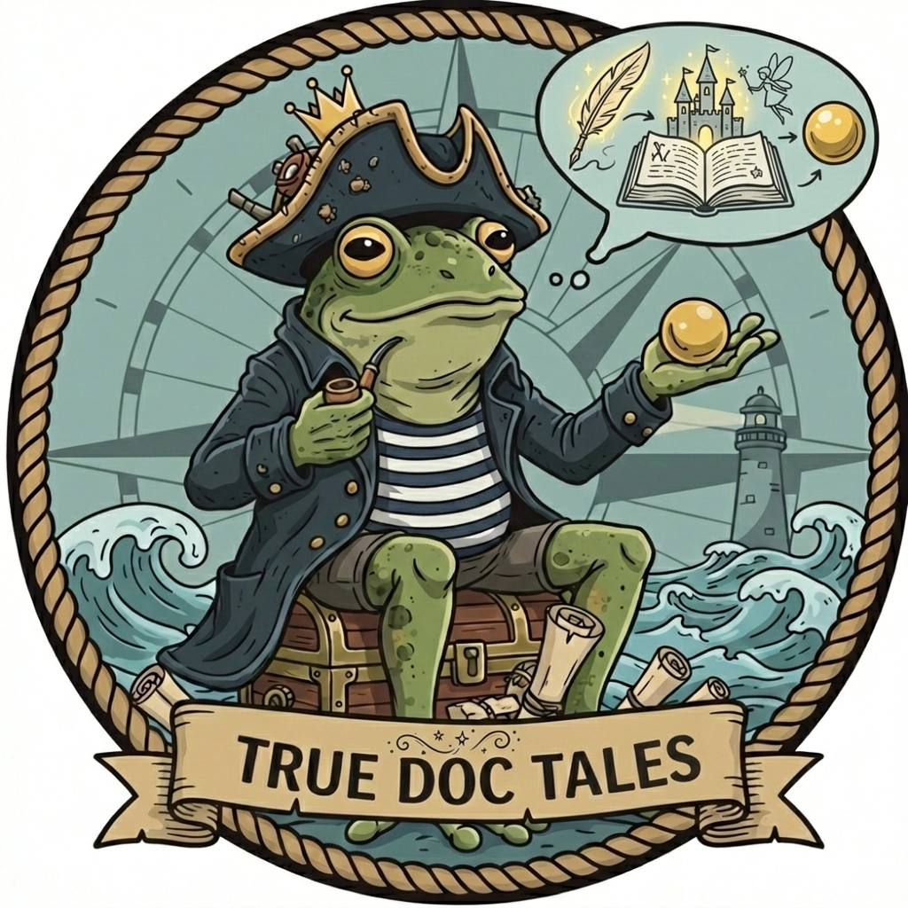

# True Doc Tales

> *From fairy tale to trusted truth*



[](https://github.com/truedoctales/truedoctales-4j/actions/workflows/pages.yml)
[](https://opensource.org/licenses/Apache-2.0)
[](https://openjdk.org/projects/jdk/25/)

A story-based testing framework for Java that turns business documentation into living, executable specifications — so your documentation never becomes a fairy tale.

---

## The Problem

Teams write documentation with the best intentions. But as soon as the software changes, the documentation starts drifting away from reality.

Product owners use documents to explain requirements. Developers use them to understand behavior. Testers use them to validate expectations. Over time the system evolves, small changes accumulate, and the written story no longer matches the implemented one.

In the age of AI-generated code this risk becomes even bigger. Teams can produce changes faster than ever, but speed without validation means misunderstandings, false assumptions, and undocumented behavior can spread much faster.

**That is the moment when documentation turns into a fairy tale**: it sounds plausible, it was once true, but nobody can fully trust it anymore.

---

## The Solution

True Doc Tales closes the gap between **what people say the system does** and **what the system actually does**.

- Business stories do not live separately from validation
- Examples are not static text that silently becomes outdated
- Documentation earns trust by being verified continuously
- AI-generated implementation is guided by clear, testable expectations

When stories are executed and validated by tests, they stop being wishful thinking and become evidence.

---

## Who Benefits

| Role | Benefit |
|------|---------|
| **Product Owners** | Documented business stories are not only well written — they are proven |
| **Developers** | Expectations connect directly to executable validation, reducing ambiguity |
| **Testers / QA** | Examples are both human-readable and automatically enforced |
| **AI / Vibe Coders** | Executable specs act as guardrails, so generated code can be checked against real business behavior |
| **The whole organization** | Documentation is no longer a communication artifact — it is a validation tool |

---

## Features

- **Narrative-driven tests** — write stories in plain Markdown; the framework executes them as JUnit tests
- **`@Plot` / `@Step` annotations** — bind Markdown steps to Java methods with zero boilerplate
- **Inline variables** — pass values from story text directly to method parameters
- **Data-table support** — drive a single step over multiple rows for specification-by-example
- **Assertion tables** — declare expected outputs in Markdown; the framework verifies them
- **Rich reports** — generate JSON, HTML, and enriched Markdown reports after every test run
- **Maven plugin** — merge execution results back into the original book Markdown in one command

---

## Quick Start

### Prerequisites

- Java 25+
- Maven 3.9+

### 1. Add the dependency

```xml
<dependency>
  <groupId>dev.truedoctales</groupId>
  <artifactId>truedoctales-4j-execution</artifactId>
  <version>0.0.1</version>
  <scope>test</scope>
</dependency>
```

> Artifacts are published to [GitHub Packages](https://github.com/truedoctales/truedoctales-4j/packages).

### 2. Write a story (Markdown)

```markdown
## Story: Greet a team member

> **Greeting** Greet *John*
```

### 3. Implement the plot (Java)

```java
@Plot("Greeting")
public class GreetingPlot {

    @Step(value = "Greet ${name}", description = "Greets the person by name.")
    public void greet(
            @Variable(value = "name", description = "Name of the person to greet") String name) {
        System.out.println("Hello, " + name + "!");
    }
}
```

### 4. Register and run

```java
@ClassTemplate
@ExtendWith({StoryTestProvider.class})
@StoryBook(path = "../my-stories", listener = {JsonStoryListener.class})
public class StoryBookTest {

    @TestFactory
    public Stream<DynamicNode> runStory() {
        SimplePlotRegistry registry = new SimplePlotRegistry();
        registry.register(new GreetingPlot());

        StoryBookExecutionMapperImpl mapper =
                new StoryBookExecutionMapperImpl(registry.getBindings());
        StoryBookExecution execution = mapper.apply(book);

        return new JupiterStoryTestExecutor(registry, listener)
                .buildDynamicTests(execution, storyPath);
    }
}
```

### 5. Generate the enriched report

```bash
# Run tests and generate execution JSON
mvn clean verify

# Merge results back into the book Markdown
mvn site
```

Enriched Markdown (with ✅ / ❌ badges) is written to `target/truedoctales-markdown/`.

---

## Module Overview

| Module | Description |
|--------|-------------|
| `truedoctales-4j-api` | Core annotations (`@Plot`, `@Step`, `@Variable`, `@Table`, `@StoryBook`) and interfaces |
| `truedoctales-4j-parser` | Markdown story parser |
| `truedoctales-4j-execution` | JUnit Jupiter execution engine and `SimplePlotRegistry` |
| `truedoctales-4j-report-json` | JSON execution listener |
| `truedoctales-4j-report-html` | HTML report generator |
| `truedoctales-4j-report-markdown` | Enriched Markdown report generator |
| `truedoctales-4j-maven-plugin` | Maven plugin that merges execution results into book Markdown |
| `truedoctales-4j-sample-domain` | Example domain model (heroes, quests, sprints…) |
| `truedoctales-4j-sample-jupiter` | End-to-end sample showing all framework features |

---

## Documentation

The `fairy-doc-tales/` directory contains the living documentation for this project — Markdown stories that are executed as part of the build and serve as both specification and example.

| Chapter | Topic |
|---------|-------|
| `01_framework-basics` | Complete technical reference: plots, steps, variables, tables |
| `02_mirror-stakeholder` | Documentation drift and the mirror stakeholder pattern |
| `03_squirrel-dev` | The squirrel developer and undocumented behavior |
| `04_product-queen` | Product owner perspective and specification confidence |
| `05_true-doc-tales-success` | Full end-to-end success story |

---

## Building from Source

```bash
git clone https://github.com/truedoctales/truedoctales-4j.git
cd truedoctales-4j

# Build and run all tests
./mvnw clean verify

# Build and generate the full HTML report
./mvnw clean verify -pl truedoctales-4j-sample-jupiter -am
```

---

## Contributing

Contributions are welcome! Please open an issue to discuss what you would like to change before submitting a pull request.

1. Fork the repository
2. Create a feature branch (`git checkout -b feature/my-feature`)
3. Commit your changes following [Conventional Commits](https://www.conventionalcommits.org/)
4. Push the branch and open a pull request

Code style is enforced automatically by [Spotless](https://github.com/diffplug/spotless) (Google Java Format). Run `./mvnw spotless:apply` before pushing.

---

## License

This project is licensed under the [Apache License 2.0](LICENSE).

---

## Author

[Kay Landeck](https://github.com/coding4kay)

---

*True Doc Tales — because your documentation deserves to be true.*
