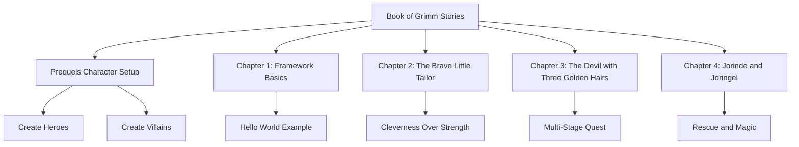

# True Doc Tales

*Fairy tales become reality*


Welcome to **True Doc Tales** — a framework for creating **living documentation**: documentation that executes as tests and validates itself with every run.

## Why Is It Called "True Doc Tales"?

Every great name tells a story. This one tells the story of documentation itself.

| Stage | What happens |
|-------|-------------|
| 📖 **Written** | Documentation is a *utopia* — a vision of how the system should work |
| 🚀 **Implemented** | For a while, the docs are accurate and *true* |
| ⏳ **Over time** | Reality drifts, code evolves, the docs become a *fairy tale* — "once upon a time, this is how it worked…" |
| ✅ **Tested & Validated** | When examples are continuously executed and verified by real tests, the documentation becomes trustworthy again — it is a *true* story you can rely on |

That journey — from **utopia** to **truth** to **fairy tale** and back to **truth** — is exactly what this project addresses.  
The book of stories you can trust: **True Doc Tales**.

## A Real-World Example: The DNS Mystery

Imagine this scenario — one that every engineer or operations person has lived through:

> *"I set up my home network with a Pi-hole as the DNS server. My router has DHCP disabled, everything looks correct in the config. After a restart, everything seems to work fine… but something feels off. I run `nslookup` on my laptop and discover it's not actually using Pi-hole as the DNS server at all."*

**The documented configuration** says Pi-hole is the DNS.  
**The actual runtime behaviour** says otherwise.

No error. No alarm. Just silent divergence between what is written and what is real.

This gap — between *expected behaviour* and *actual behaviour* — is not unique to home networks. It lives in every production system, every microservice, every API contract. And it is almost always invisible until something breaks at the worst possible moment.

> **True Doc Tales exists to close that gap.**

## The Problem with Traditional Documentation

We've all seen it happen:

📄 **Day 1:** Beautiful documentation, perfectly describing the system  
📅 **Week 3:** Code evolves, docs drift  
🕸️ **Month 6:** Documentation becomes fiction  
❌ **Year 1:** Nobody trusts the docs anymore

**Traditional documentation dies the moment you write it.** It can't verify itself. It can't adapt. It becomes a historical artifact rather than a living guide.

## Living Documentation: A Different Paradigm

**What if your documentation could run?**  
**What if it validated itself every time your tests run?**  
**What if being out-of-date was impossible because outdated docs simply fail?**

This is **living documentation** - documentation that:
- ✅ **Executes** as part of your test suite
- ✅ **Validates** its own accuracy with every run
- ✅ **Fails** immediately when reality diverges from documentation
- ✅ **Lives** alongside your code, staying perpetually current

True Doc Tales makes your documentation **executable** and **self-verifying**. When the docs run green, they're guaranteed to be correct. When requirements change, outdated docs fail fast, forcing updates.

## Why Product Owners and Stakeholders Need This

If you are a **product owner**, a **team lead**, or anyone who relies on documentation to make decisions, this section is for you.

### The Business Cost of Untrustworthy Docs

When documentation cannot be trusted, the hidden costs multiply:

| Problem | Business Impact |
|---------|----------------|
| Outdated specs | Developers build the wrong thing |
| Undiscoverable behaviour | New team members make avoidable mistakes |
| Silent configuration drift | Production incidents that surprise everyone |
| "I thought it worked that way" | Bugs discovered by customers, not by the team |

The DNS example above is not an edge case — it is the *norm* in complex systems. The config looks right. The documentation says it is right. But the system behaves differently, and nobody notices until it matters.

### What True Doc Tales Gives You

- 🔒 **Confidence** — If the docs run green, they describe how the system actually behaves right now
- 🚀 **Faster onboarding** — New team members read stories that are guaranteed to be accurate
- 🛡️ **Reduced risk** — Breaking changes immediately surface as failing docs, not as production incidents
- 🤝 **Shared language** — Product, engineering, and operations all work from the same verified source of truth
- 📈 **Sustainable quality** — Documentation stays current because it *has* to: outdated docs fail

> **For a product owner:** You no longer have to wonder whether the feature you approved actually works the way the spec says. The passing tests *are* the proof.

## How It Works

Instead of writing documentation that *describes* how your system works, you write documentation that *demonstrates* how it works:

```markdown
# The Brave Little Tailor

## Scene: The tailor's great boast

> **Hero** Create hero
> 
> | id | name   | species | age |
> |----|--------|---------|-----|
> | 1  | Tailor | Human   | 25  |

> **Hero** Grant skill
> 
> | heroName | skill      |
> |----------|------------|
> | Tailor   | Cleverness |
```

This markdown **runs as a test**. It executes real code. It validates real behavior. It's simultaneously:
- 📖 **Documentation** - Readable by humans, tells a story
- ✅ **Test** - Executable by machines, verifies correctness
- 📋 **Specification** - Defines expected behavior precisely
- 🛡️ **Guard** - Fails when documentation lies

## Why Stories? Why Grimm Brothers Fairy Tales?

**One excellent example beats a dozen incomplete ones.**

The Brothers Grimm collected some of the most memorable stories in human history. These fairy tales provide the perfect living documentation metaphor:
- ✅ **Memorable** - "Tailor tricks giants" > "User #42 workflow"
- ✅ **Complete** - Full story lifecycle from setup to resolution
- ✅ **Engaging** - Narrative docs are maintainable docs
- ✅ **Universal** - Maps to real patterns (quests = processes, heroes = users)

The storytelling approach isn't just stylistic - it's strategic. Stories are:
- **Comprehensible** - Anyone can understand a fairy tale narrative
- **Maintainable** - Good stories resist rot better than technical specs
- **Educational** - New developers learn by reading executable tales
- **Validating** - The story only passes if the system truly behaves that way

Business logic wrapped in fairy tales:
- **Heroes** → Users/Actors
- **Quests** → Workflows/Processes  
- **Villains** → Edge Cases/Threats
- **Magic** → Capabilities/Features
- **Happy Endings** → Success States/Completions

The patterns are universal, but the stories make them unforgettable AND verifiable.

## What You'll Find in This Book



### Chapter 1: Framework Basics - Your First Living Document
**Learn the fundamentals** of creating executable documentation.
- Setting up your first living doc (Hello World)
- Connecting markdown stories to real code
- Understanding the execution model
- The Greeting plot in action

### Chapter 2: The Brave Little Tailor - Cleverness Defeats Giants
**Seven at one blow!** A humble tailor tricks his way to glory.
- A tailor's boast leads to impossible challenges
- Outwitting giants and fierce beasts through cunning
- Winning a kingdom through cleverness, not strength
- Demonstrates: Quest lifecycle, skill-based victories, achievement progression

### Chapter 3: The Devil with the Three Golden Hairs - Multi-Stage Adventure  
**A perilous journey through hell and back.**
- A young hero must obtain three golden hairs from the devil
- Multiple helpers aid the quest (grandmother, ferryman)
- Solving riddles and completing sub-quests
- Demonstrates: Complex quest chains, multi-hero collaboration, quest completion rewards

### Chapter 4: Jorinde and Joringel - Rescue from the Witch's Castle
**Love conquers dark magic.**
- Jorinde transformed into a nightingale by an evil fairy
- Joringel's quest to find the magic flower
- Rescuing Jorinde and defeating the fairy's curse
- Demonstrates: Monster encounters, magic items, rescue missions, happy endings

## The Promise

With True Doc Tales, your documentation:
- **Never lies** - If it runs, it's true. If it's false, it fails.
- **Never rots** - Breaking changes break the docs, forcing updates
- **Never confuses** - Stories are clearer than specifications
- **Never bores** - Fairy tales beat dry technical writing

## Getting Started

1. **Prequels:** Setup your fairy tale world with heroes and villains
2. **Chapter 1-3:** Experience three complete Grimm Brothers tales
3. **Your Domain:** Transform your specs into executable fairy tales

*Once upon a time, there was documentation that always told the truth...*


