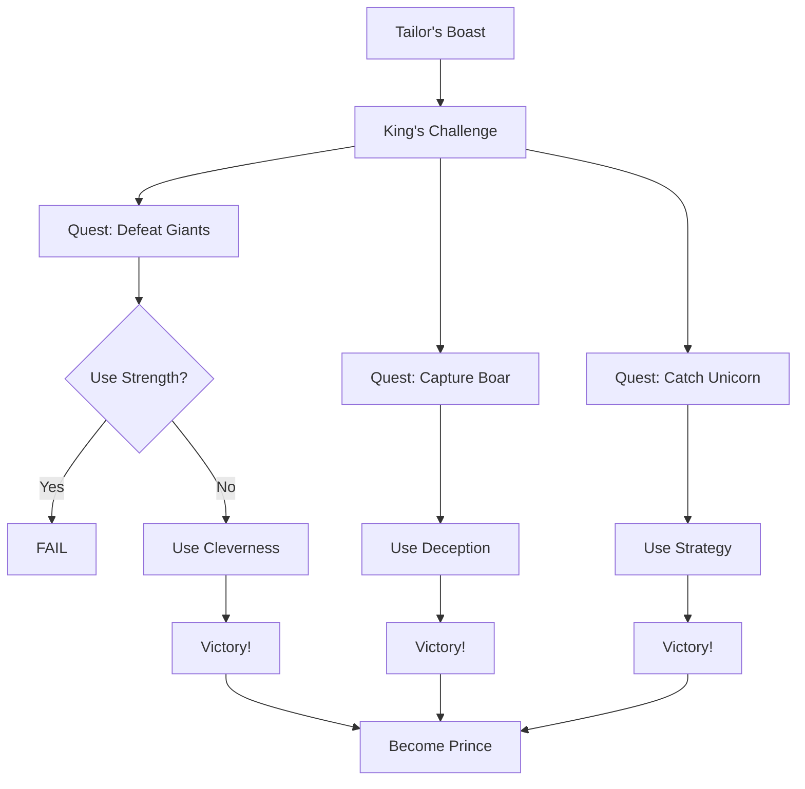

# Chapter 2: The Brave Little Tailor - Seven at One Blow!

## Overview

This chapter presents the tale of **The Brave Little Tailor**, a humble craftsman who uses his wits to defeat giants and win a kingdom.

The story demonstrates **best practices** for living documentation:
- ✅ **Cleverness over strength** - Skills determine victory, not brute force
- ✅ **Quest progression** - From boast to kingdom
- ✅ **Failed attacks matter** - Testing negative cases
- ✅ **Skill-based combat** - Using the right ability at the right time
- ✅ **Achievement tracking** - Rewarding incremental success

## The Tale

A humble tailor kills seven flies with one blow and embroiders "SEVEN AT ONE BLOW" on his belt. Townspeople mistake this for seven men, and soon the tailor finds himself challenged by the king to defeat two fierce giants, capture a wild boar, and catch a unicorn. 

Can cleverness triumph where strength would fail? Will a simple tailor become a prince?

## Plot Usage

This story uses the following plots to demonstrate **complete framework capability**:
- **Hero** - Character creation and skill progression
- **Monster** - Multiple villain tracking
- **Quest** - Complex mission lifecycle
- **Fight** - Both failed and successful combat
- **Achievement** - Progressive victory recognition

## Story Structure

*"Seven at one blow!" - A boast that changed everything...*
