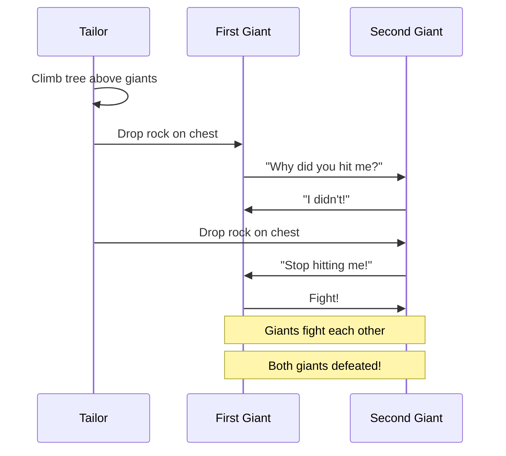

# The Brave Little Tailor - Seven at One Blow!

One summer morning, a humble tailor sat in his workshop sewing. Annoyed by flies buzzing around his jam, he swatted them with a cloth - killing seven at once! Proud of his feat, he embroidered a belt reading "SEVEN AT ONE BLOW!" and set off to seek his fortune.

**This story demonstrates:** Quest lifecycle, skill-based combat over brute strength, testing both failures and successes, and progressive achievement unlocking.

> Prequels
> - [Create Heroes](../00_prequels/01_create-heroes.md)
> - [Create Villains](../00_prequels/02_create-monsters.md)

## Scene: The king's first impossible challenge

The tailor arrives at the king's castle. Seeing his belt, the king assumes he killed seven men and fears him. To test the tailor (and hoping he'll die trying), the king offers a challenge: defeat two giants terrorizing the kingdom.

> **Quest** Create quest
> 
> | id | name            | description                            | status      |
> |----|-----------------|----------------------------------------|-------------|
> | 1  | Defeat Giants   | Destroy the two giants in the forest   | IN_PROGRESS |

> **Quest** Assign to hero
> 
> | hero   | quest         |
> |--------|---------------|
> | Tailor | Defeat Giants |

> **Quest** Status is
> 
> | quest         | expectedStatus |
> |---------------|----------------|
> | Defeat Giants | IN_PROGRESS    |

## Scene: The giants' forest

The tailor finds two enormous giants sleeping under a tree. Each is larger than ten men. He knows he cannot fight them with strength.

## Scene: Strength fails, cleverness succeeds

The tailor tries to fight the giants directly - this would never work!

> **Fight** Attack fails
> 
> | attacker | defender      | weapon | result |
> |----------|---------------|--------|--------|
> | Tailor   | First Giant   | Sword  | FAILED |
> | Tailor   | Second Giant  | Sword  | FAILED |

But the tailor is clever! He climbs a tree and drops stones on each giant, making them think the other is attacking. The giants fight and kill each other!

> **Fight** Defeat with skill
> 
> | hero   | monster       | skill      | outcome |
> |--------|---------------|------------|---------|
> | Tailor | First Giant   | Cleverness | VICTORY |
> | Tailor | Second Giant  | Cleverness | VICTORY |

> **Monster** Monster is dead
> 
> | name          |
> |---------------|
> | First Giant   |
> | Second Giant  |

> **Quest** Complete quest
> 
> | hero   | quest         |
> |--------|---------------|
> | Tailor | Defeat Giants |

> **Quest** Status is
> 
> | quest         | expectedStatus |
> |---------------|----------------|
> | Defeat Giants | COMPLETED      |

> **Achievement** Unlocked
> 
> | hero   | achievement    |
> |--------|----------------|
> | Tailor | Giant Slayer   |

## Scene: The wild boar challenge

The king is shocked the tailor survived. He sets another impossible task: capture the fierce wild boar that has been attacking hunters.

> **Quest** Create quest
> 
> | id | name         | description                     | status      |
> |----|--------------|----------------------------------|-------------|
> | 2  | Capture Boar | Bring back the wild boar alive   | IN_PROGRESS |

> **Quest** Assign to hero
> 
> | hero   | quest        |
> |--------|--------------|
> | Tailor | Capture Boar |

The tailor finds the boar and deliberately angers it. The boar charges! The tailor runs into a nearby chapel, then leaps out a window. The boar, too heavy to stop, crashes through the door and becomes trapped inside.

> **Fight** Defeat with skill
> 
> | hero   | monster   | skill     | outcome |
> |--------|-----------|-----------|---------|
> | Tailor | Wild Boar | Deception | VICTORY |

> **Monster** Monster is dead
> 
> | name      |
> |-----------|
> | Wild Boar |

> **Quest** Complete quest
> 
> | hero   | quest        |
> |--------|--------------|
> | Tailor | Capture Boar |

> **Quest** Status is
> 
> | quest        | expectedStatus |
> |--------------|----------------|
> | Capture Boar | COMPLETED      |

> **Achievement** Unlocked
> 
> | hero   | achievement  |
> |--------|--------------|
> | Tailor | Beast Master |

## Scene: The unicorn hunt

For the final test, the king demands the tailor catch the legendary unicorn.

> **Quest** Create quest
> 
> | id | name          | description                | status      |
> |----|---------------|----------------------------|-------------|
> | 3  | Catch Unicorn | Catch the magical unicorn  | IN_PROGRESS |

> **Quest** Assign to hero
> 
> | hero   | quest         |
> |--------|---------------|
> | Tailor | Catch Unicorn |

The tailor ventures into the magical forest and waits by a tree.

When the unicorn charges him with its horn aimed to strike, the tailor dodges at the last second. The unicorn's horn embeds deep in the tree trunk! Unable to pull free, the unicorn is caught.

> **Fight** Defeat with skill
> 
> | hero   | monster  | skill      | outcome |
> |--------|----------|------------|---------|
> | Tailor | Unicorn  | Cleverness | VICTORY |

> **Monster** Monster is dead
> 
> | name    |
> |---------|
> | Unicorn |

> **Quest** Complete quest
> 
> | hero   | quest         |
> |--------|---------------|
> | Tailor | Catch Unicorn |

> **Quest** Status is
> 
> | quest         | expectedStatus |
> |---------------|----------------|
> | Catch Unicorn | COMPLETED      |

## Scene: The tailor becomes a prince

Having completed all three impossible tasks, the tailor claims his reward. The king must keep his promise - the tailor marries the princess and becomes a prince!

> **Hero** Trophy earned
> 
> | hero   | trophy          |
> |--------|-----------------|
> | Tailor | Royal Crown     |
> | Tailor | Giant's Treasure|
> | Tailor | Unicorn's Horn  |

> **Hero** Level is
> 
> | hero   | expectedLevel |
> |--------|---------------|
> | Tailor | 5             |

> **Achievement** Unlocked
> 
> | hero   | achievement      |
> |--------|------------------|
> | Tailor | Prince of Realm  |
> | Tailor | Master of Quests |

## Moral of the Story

**Cleverness conquers strength. Strategy defeats brute force.**

This living documentation proves that:
- ✅ Failed combat attempts are valid test cases (Attack fails)
- ✅ The right skill used at the right time determines victory
- ✅ Multiple quests can be tracked in parallel
- ✅ Progressive achievements reward incremental success
- ✅ A complete hero journey from nobody to royalty

**And so the brave little tailor, who started his journey by killing seven flies, ended it as a prince. His motto remained forever: "SEVEN AT ONE BLOW!"**

