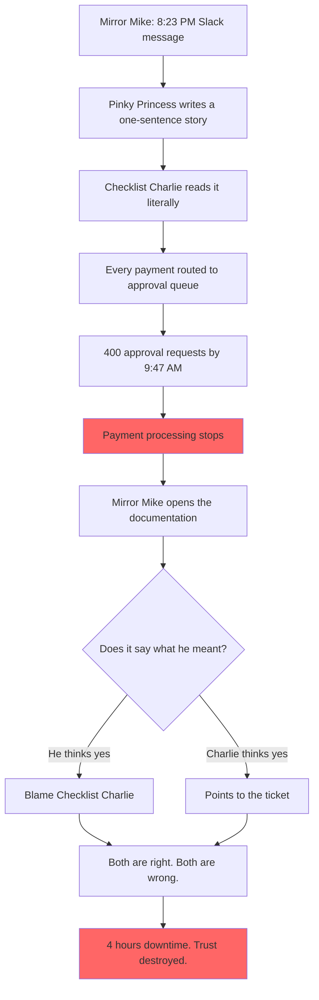

# Mirror, Mirror — Who Wrote It Wrong?

## Meet the cast

Before the story begins, meet the three colleagues who will make Tuesday morning very expensive.

---

### 🪞 Mirror Mike — Chief Financial Officer

**His superpower:** Turns a complex compliance requirement into a single Slack message at 8:23 PM.

**His weakness:** Communicates business needs in one sentence and considers his job done. The details, the edge cases, the thresholds — those are *someone else's problem*. When things go wrong, Mirror Mike opens the documentation, holds it up like a mirror, and sees exactly what he expected to find: someone else's mistake.

> *"I said approval step. I never said every payment. That was obvious."*

---

### 👑 Pinky Princess — Product Owner

**Her superpower:** Can write a user story in eleven minutes flat. Clear language. Good structure. Confident tone.

**Her weakness:** Writes what she heard, not what was meant. Never asks for a concrete example. Never checks whether the story she wrote matches the intent of the person who asked. In her mind, a well-written sentence is a well-defined requirement.

> *"It says what it says. I can't help what people read into it."*

---

### ✅ Checklist Charlie — Senior Developer

**His superpower:** Fastest ticket closure rate on the team. Monday morning pickup, Friday afternoon green.

**His weakness:** Reads the first acceptance criterion, builds it precisely, and marks the ticket done. He is not lazy — he is literal. The story said "approve payments". He approved payments. All of them. Every single one.

> *"The ticket says payments. I built payments. Show me where it says ten thousand euros."*

---

## The Problem

A compliance requirement needs a payment approval workflow. It gets communicated as a paragraph, written as a sentence, and implemented as an absolute rule — because nobody, at any point, wrote down a single concrete example.

By Tuesday morning, every €7.50 coffee subscription in the country is waiting for a manager to click *approve*.

## Story Structure

*The mirror shows everyone exactly what they want to see.*
*That is why nobody trusts it.*
