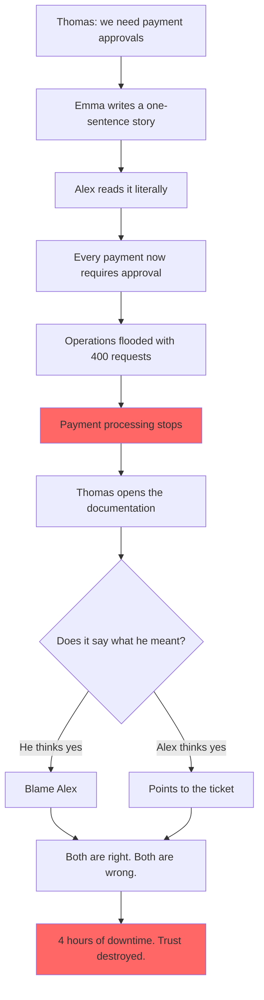

# Mirror, Mirror — Who Wrote It Wrong?

## Overview

Thomas is the CFO of FinTrack Solutions. He approves feature budgets, attends sprint reviews, and reads documentation like a contract.

Emma is the Product Owner. She writes user stories between Zoom calls. She is good at it — fast, clear, confident.

Alex is the developer. He builds what the story says. He does not guess. He does not invent.

This is the story of a feature that everyone understood differently — and how a single missing example brought a payment platform to its knees for four hours on a Tuesday morning.

## The Problem

Thomas asked for an **approval workflow for payments**. He meant: *large transactions above €10,000 should require manager sign-off*.

Emma wrote: *"As a manager, I want to approve payments before they are processed."*

Alex read it and built exactly that. Every payment. Every amount. Every time.

Nobody reviewed the story with a concrete example. Nobody asked: *which payments, exactly?*

## What Goes Wrong

- ✗ The requirement is one sentence with no example and no threshold
- ✗ The developer builds the most literal interpretation of the story
- ✗ Operations receives 400 approval requests in two hours
- ✗ Payment processing stops. Revenue drops 40% for the morning.
- ✗ Thomas quotes the requirement. Alex quotes the implementation. Both are correct.
- ✗ Nobody can prove who was right — because the story was never verified

## Story Structure

*The mirror shows everyone exactly what they want to see.*
*That is why nobody trusts it.*
