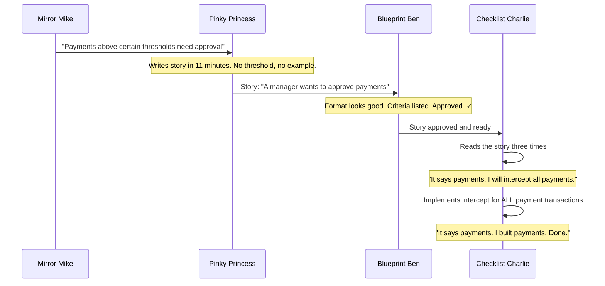

# Mirror, Mirror — Who Wrote It Wrong?

9:47 AM. Tuesday. The FinTrack payment platform is processing zero transactions per minute.

Mirror Mike calls Pinky Princess. Pinky Princess calls Checklist Charlie. Checklist Charlie opens the ticket and reads it carefully.

*The ticket says exactly what he built.*

> Prequels
> - [The Team](../00_prequels/03_create-business-heroes.md)
> - [The Risks](../00_prequels/04_create-business-villains.md)

---

## Scene: Mirror Mike fires off the requirement

It is 8:23 PM on a Thursday. Mirror Mike is in Dubai at a fintech conference, presenting FinTrack's roadmap to potential partners. His phone buzzes — the quarterly compliance report has arrived in his inbox. There is a finding.

Last quarter, a high-value transfer was processed without any secondary authorisation. The auditor flagged it. The regulatory framework requires an approval mechanism for large transactions. Mirror Mike knows this. He has known it for three months.

He opens Slack and types a message to Pinky Princess.

> *"Hey PP — we had an audit finding last quarter. Payments above certain thresholds need manager approval before processing. Can we get this into the next sprint?"*

He sends it. He puts his phone away. He goes back to his presentation.

In eleven time zones away, Pinky Princess will see that message in the morning.

> **Sprint** Plan sprint
>
> | id | name      | plannedPoints | goal                        |
> |----|-----------|---------------|-----------------------------|
> | 2  | Sprint 11 | 21            | Payment compliance features |

> **Sprint** Add task *Sprint 11*
>
> | task                    | points |
> |-------------------------|--------|
> | Payment Approval Flow   | 13     |
> | Duplicate Payment Check | 8      |

---

## Scene: Pinky Princess writes the story in eleven minutes

Friday morning. Pinky Princess opens Slack. She reads Mirror Mike's message. She is already late for sprint planning prep — she has six other stories to write before 9:30.

She creates a new story in Jira. She thinks about what Mirror Mike said. *"Payments above certain thresholds need manager approval."* She writes it up. Clean structure, good format, confident language.

She does not ask what "certain thresholds" means. She does not ask for an example of a payment that should require approval. She does not ask for an example of one that should not. She is a professional. She knows how to write stories.

> **Ticket** Create ticket
>
> | id | title                 | description                                             | status      |
> |----|-----------------------|---------------------------------------------------------|-------------|
> | 10 | Payment Approval Flow | Add manager approval step before payments are processed | IN_PROGRESS |

The story reads:
```
Title: Payment Approval Workflow

As a manager,
I want to approve payments before they are processed,
so that large or unusual transactions can be reviewed.

Acceptance Criteria:
- A manager can approve a pending payment
- An approved payment proceeds to processing
- A rejected payment is cancelled
```

Three acceptance criteria. Not a single number. Not a single example. Not one concrete case of what should and should not trigger the approval step.

> **Specification** Has no examples
>
> | feature                    |
> |----------------------------|
> | Payment Approval Threshold |

```
What the story needed — and never had:

| paymentAmount | requiresApproval |
|---------------|------------------|
| €7.50         | false            |
| €500.00       | false            |
| €10,001.00    | true             |

One table. Three rows. Zero ambiguity.
Without this table, every developer who reads the story will interpret it differently.
```

Mirror Mike does not review the story. He is still in Dubai. He will be back on Tuesday.

> **Ticket** Assign to developer
>
> | developer         | ticket                |
> |-------------------|-----------------------|
> | Checklist Charlie | Payment Approval Flow |

> **Ticket** Ticket status is
>
> | ticket                | expectedStatus |
> |-----------------------|----------------|
> | Payment Approval Flow | IN_PROGRESS    |

---

## Scene: The story passes review — nobody asks the important question

On Monday morning, Blueprint Ben does his weekly story review before sprint planning. He opens each ticket and checks the format: user story format? ✓ Acceptance criteria listed? ✓ Developer assigned? ✓

He does not check whether the acceptance criteria contain a single concrete example of correct system behaviour. That is not on his checklist.

He approves the story. Sprint 11 begins.

> **Risk** Risk is active
>
> | name                    |
> |-------------------------|
> | Documentation Drift     |
> | Missing Acceptance Test |

The risk is already alive before a single line of code has been written. The specification has drifted from what was intended. And there is no acceptance test that could prove the drift — because there is no concrete example to test against.

---

## Scene: Checklist Charlie reads the story and starts coding

Monday 9:15 AM. Checklist Charlie picks up the Payment Approval Flow ticket. He reads it carefully — he always reads tickets carefully. This is a point of professional pride.

*"As a manager, I want to approve payments before they are processed."*

He reads the acceptance criteria. One: a manager can approve a pending payment. Two: an approved payment proceeds to processing. Three: a rejected payment is cancelled.

He thinks about this for approximately ninety seconds.

*Payments.* The story says payments. All payments need to go through approval before processing. That is what the story says. He will build what the story says.



He spends three days building it. He builds it well. The code is clean. The architecture follows the existing patterns. The approval queue works exactly as specified. Every payment entering the system is intercepted and routed to the approval queue before it is processed.

By Thursday afternoon, the implementation is complete. By Friday morning, it has passed code review — Blueprint Ben notes the clean architecture. By Friday afternoon, it is deployed to staging. By Monday evening, it is live in production.

---

## Scene: Friday — the sprint closes green

Checklist Charlie marks the ticket done. The story he implemented matches the story Pinky Princess wrote.

> **Ticket** Close ticket
>
> | developer         | ticket                |
> |-------------------|-----------------------|
> | Checklist Charlie | Payment Approval Flow |

> **Ticket** Ticket status is
>
> | ticket                | expectedStatus |
> |-----------------------|----------------|
> | Payment Approval Flow | COMPLETED      |

Sprint 11 looks like a success. Both tasks completed. 21 story points delivered. The burndown chart is clean.

> **Sprint** Mark task done
>
> | task                    |
> |-------------------------|
> | Payment Approval Flow   |
> | Duplicate Payment Check |

> **Sprint** Reported velocity is
>
> | sprint    | expected |
> |-----------|----------|
> | Sprint 11 | 21       |

Mirror Mike gets back from Dubai on Tuesday morning. He is looking forward to seeing the payment compliance feature live.

---

## Scene: Tuesday 8:00 AM — the first payments of the day

At 8:03 AM, the first payment of the day enters the FinTrack platform. A €12.50 coffee subscription from a corporate account. It is intercepted by the new approval queue. A notification is sent to the account manager. The payment waits.

At 8:07, a second payment arrives. A €7.50 parking fee. Intercepted. Queued. Notification sent.

At 8:15, the operations team starts receiving calls. By 8:30, there are forty approval requests. By 9:00, there are two hundred. By 9:47, there are four hundred and eleven. The payment platform is processing zero transactions per minute.

Revenue: zero. Customers: confused. Operations team: overwhelmed.

Mirror Mike's phone rings. It is the head of operations.

---

## Scene: The post-mortem — the mirror shows three different stories

By 10:15, Mirror Mike, Pinky Princess, Checklist Charlie, and Blueprint Ben are in a conference room. The payment processing team has implemented a temporary bypass — payments are flowing again, but the approval feature has been disabled.

Mirror Mike opens the story on his laptop and reads it aloud.

> **Attempt** Fails
>
> | teamMember        | risk                    | approach            | result |
> |-------------------|-------------------------|---------------------|--------|
> | Checklist Charlie | Documentation Drift     | Code                | FAILED |
> | Pinky Princess    | Missing Acceptance Test | Requirements Review | FAILED |
> | Mirror Mike       | Documentation Drift     | Sprint Feedback     | FAILED |

Mirror Mike: *"It says payments above certain thresholds. I told Pinky Princess — thresholds. I meant large transactions. Obviously."*

Checklist Charlie: *"It says payments. Not large payments. Not payments above a threshold. Payments. I built payments."*

Pinky Princess: *"You said 'payments above certain thresholds'. I wrote approval step. What threshold did you mean? You never told me."*

Nobody is lying. Everyone is reading the same document and seeing something different. The document reflects back exactly what each person wants to find in it.

> **Risk** Risk is active
>
> | name          |
> |---------------|
> | Blame Culture |

> **Attempt** Fails
>
> | teamMember    | risk          | approach            | result |
> |---------------|---------------|---------------------|--------|
> | Blueprint Ben | Blame Culture | Architecture Review | FAILED |
> | Pinky Princess| Blame Culture | Story Revision      | FAILED |

The platform is patched in two hours. The threshold is set to €10,000. The operations team clears the queue by lunchtime. The post-mortem report lists the root cause as *"ambiguous acceptance criteria."*

That is the polite version. The accurate version is: nobody wrote a single example.

> **Sprint** Close sprint
>
> | sprint    |
> |-----------|
> | Sprint 11 |

> **Sprint** Sprint status is
>
> | sprint    | expected |
> |-----------|----------|
> | Sprint 11 | FAILED   |

---

## Moral of the Story

**A specification without a single concrete example is not a specification. It is an invitation to be misunderstood.**

Three people communicated correctly at every stage. Mirror Mike sent his requirement. Pinky Princess wrote her story. Checklist Charlie implemented the story. And the result was four hours of payment downtime, four hundred approval requests, and a post-mortem that generated more blame than insight.

The fix was not a better meeting or a clearer escalation path. The fix was one table:

| paymentAmount | requiresApproval |
|---------------|------------------|
| €7.50         | false            |
| €500.00       | false            |
| €10,001.00    | true             |

Three rows. Zero ambiguity. Zero downtime.

- ✗ One ambiguous sentence → four hours of zero revenue processing
- ✗ Reported velocity: 21 points. Verified outcome: system broken.
- ✗ Three colleagues were simultaneously right and wrong. The story was neither.

*The next sprint begins on Monday. The next compliance story is already in the backlog.*
*Pinky Princess opens Jira. She types the first sentence.*
*It is one sentence long.*
