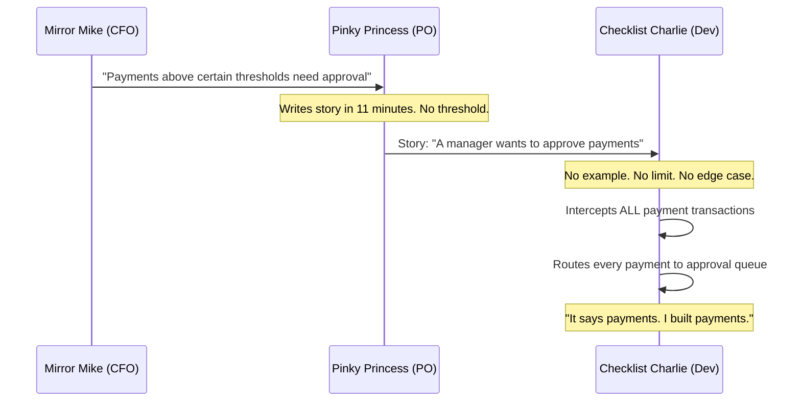

# Mirror, Mirror — Who Wrote It Wrong?

It is 9:47 on a Tuesday morning. The FinTrack payment platform has been live for three years. Today, it is processing zero transactions per minute.

In the operations room, 400 approval requests have arrived since 8:00. Every single payment — a €12 coffee subscription, a €7.50 parking fee, a €3 app store charge — is waiting for a manager to click *approve* before it can be processed.

Mirror Mike calls Pinky Princess. Pinky Princess calls Checklist Charlie. Checklist Charlie opens the ticket.

*The ticket says exactly what he built.*

> Prequels
> - [The Team](../00_prequels/03_create-business-heroes.md)
> - [The Villains](../00_prequels/04_create-business-villains.md)

## Scene: The feature request — one paragraph, zero examples

Three weeks ago, Mirror Mike sent Pinky Princess a Slack message at 8:23 PM.

*"Hey, we had an audit finding last quarter. Payments above certain thresholds need manager approval before processing. Can we get this into the next sprint?"*

Pinky Princess was already preparing the next day's sprint planning. She had six other stories to finish. She wrote the story in eleven minutes.

> **Quest** Create quest
>
> | id | name                    | description                                             | status      |
> |----|-------------------------|---------------------------------------------------------|-------------|
> | 10 | Implement Approval Flow | Add manager approval step before payments are processed | IN_PROGRESS |

> **Quest** Assign to hero
>
> | hero              | quest                   |
> |-------------------|-------------------------|
> | Checklist Charlie | Implement Approval Flow |

> **Quest** Status is
>
> | quest                   | expectedStatus |
> |-------------------------|----------------|
> | Implement Approval Flow | IN_PROGRESS    |

The story read:

```
Title: Payment Approval Workflow

As a manager,
I want to approve payments before they are processed,
so that large or unusual transactions can be reviewed.

Acceptance Criteria:
- A manager can approve a pending payment
- An approved payment proceeds to processing
- A rejected payment is cancelled
```

No threshold. No example. No definition of *which* payments.

Mirror Mike did not review the story. He was in Dubai at a conference.

## Scene: Checklist Charlie builds what the story says

Checklist Charlie picks up the ticket on Monday morning. He reads the acceptance criteria three times.

He has questions — but the sprint ends Friday, and asking Pinky Princess means waiting until Wednesday when she is back from her product strategy workshop. He implements what the story says.



> **Monster** Monster is alive
>
> | name                    |
> |-------------------------|
> | Documentation Drift     |
> | Missing Acceptance Test |

By Wednesday the feature is built. By Thursday it passes Charlie's unit tests. By Friday it is merged. On Monday morning it goes live.

## Scene: The Tuesday morning crisis

By 8:15, the operations team starts receiving approval requests. By 9:47, there are 400 of them and payment processing has stopped.

> **Quest** Complete quest
>
> | hero              | quest                   |
> |-------------------|-------------------------|
> | Checklist Charlie | Implement Approval Flow |

> **Quest** Status is
>
> | quest                   | expectedStatus |
> |-------------------------|----------------|
> | Implement Approval Flow | COMPLETED      |

The ticket is green. The story is done. The system is broken.

Mirror Mike: *"Why is every payment in an approval queue?"*
Pinky Princess: *"Why did you put every payment through approval?"*
Checklist Charlie: *"Because that is what the story says."*

> **Fight** Attack fails
>
> | attacker          | defender                | weapon              | result |
> |-------------------|-------------------------|---------------------|--------|
> | Checklist Charlie | Documentation Drift     | Code                | FAILED |
> | Pinky Princess    | Missing Acceptance Test | Requirements Review | FAILED |
> | Mirror Mike       | Documentation Drift     | Sprint Feedback     | FAILED |

The feature is correct. The story is wrong. Nobody can prove which, because there is no concrete example to point to.

## Scene: The mirror's verdict

Mirror Mike opens the documentation and reads it aloud in the post-mortem.

*"As a manager, I want to approve payments before they are processed."*

*"That does not say every payment. It says large transactions. The audit finding was about transactions above ten thousand euros."*

Checklist Charlie: *"That is not in the story."*

> **Monster** Monster is alive
>
> | name          |
> |---------------|
> | Blame Culture |

Pinky Princess wrote what she heard. Checklist Charlie built what she wrote. Mirror Mike communicated what he assumed was obvious. At no step was the result verified against a concrete example.

> **Fight** Attack fails
>
> | attacker       | defender      | weapon              | result |
> |----------------|---------------|---------------------|--------|
> | Blueprint Ben  | Blame Culture | Architecture Review | FAILED |
> | Pinky Princess | Blame Culture | Story Revision      | FAILED |

The platform is patched in two hours. The feature is restricted to payments above €10,000. The operations team clears the queue by lunchtime. The post-mortem report lists the root cause: *"Ambiguous acceptance criteria."*

That is the polite way of saying: the mirror showed everyone what they wanted to see.

## Moral of the Story

**A requirement without a concrete example is not a requirement. It is an invitation to be misunderstood.**

If the story had contained a single example table:

| paymentAmount | requiresApproval |
|---------------|------------------|
| €7.50         | false            |
| €500.00       | false            |
| €10,001.00    | true             |

— then Checklist Charlie would have built the right thing. Bugfinder Betty would have verified it. Mirror Mike would have approved it. And Tuesday morning would have been completely, unremarkably normal.

- ✗ One ambiguous sentence caused four hours of zero revenue processing
- ✗ Three colleagues were right. Three colleagues were wrong. Nobody could prove it.
- ✗ The mirror reflects what each reader brings to it

*The next sprint begins. The next story is already one sentence long.*
