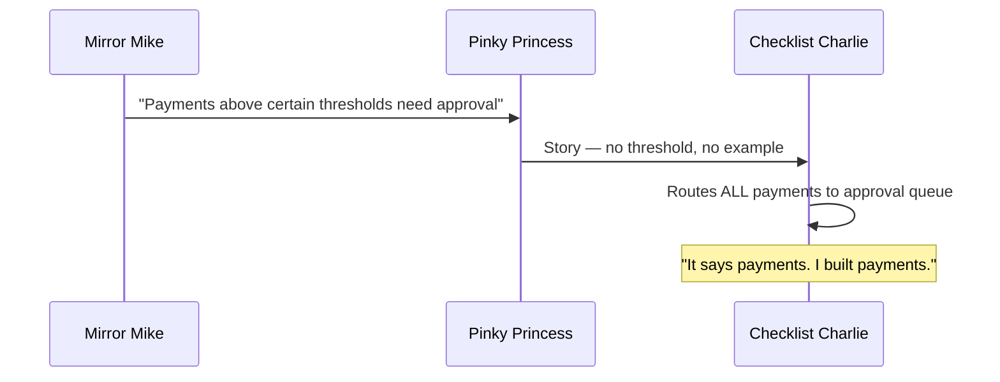

# Mirror, Mirror — Who Wrote It Wrong?

9:47 AM. Tuesday. The FinTrack payment platform is processing zero transactions per minute.

Mirror Mike calls Pinky Princess. Pinky Princess calls Checklist Charlie. Checklist Charlie opens the ticket. *The ticket says exactly what he built.*

> Prequels
> - [The Team](../00_prequels/03_create-business-heroes.md)
> - [The Risks](../00_prequels/04_create-business-villains.md)

## Scene: The sprint picks up the compliance ticket

Three weeks ago, Mirror Mike sent a Slack message at 8:23 PM: *"Payments above certain thresholds need manager approval. Can we get this into the next sprint?"*

Pinky Princess wrote the story in eleven minutes. Mirror Mike did not review it. He was in Dubai.

> **Sprint** Plan sprint
>
> | id | name      | plannedPoints | goal                              |
> |----|-----------|---------------|-----------------------------------|
> | 2  | Sprint 11 | 21            | Payment compliance features       |

> **Sprint** Add task *Sprint 11*
>
> | task                    | points |
> |-------------------------|--------|
> | Payment Approval Flow   | 13     |
> | Duplicate Payment Check | 8      |

> **Ticket** Create ticket
>
> | id | title                   | description                                             | status      |
> |----|-------------------------|---------------------------------------------------------|-------------|
> | 10 | Payment Approval Flow   | Add manager approval step before payments are processed | IN_PROGRESS |

> **Ticket** Assign to developer
>
> | developer         | ticket                  |
> |-------------------|-------------------------|
> | Checklist Charlie | Payment Approval Flow   |

> **Ticket** Ticket status is
>
> | ticket                  | expectedStatus |
> |-------------------------|----------------|
> | Payment Approval Flow   | IN_PROGRESS    |

## Scene: The specification has no examples

The story said: *"As a manager, I want to approve payments before they are processed."*

No threshold. No example. Not one concrete case of what should and should not trigger approval.

> **Specification** Has no examples
>
> | feature                         |
> |---------------------------------|
> | Payment Approval Threshold      |

```
What the story needed — and never had:

| paymentAmount | requiresApproval |
|---------------|------------------|
| €7.50         | false            |
| €500.00       | false            |
| €10,001.00    | true             |

One table. Three rows. Zero ambiguity.
```

> **Risk** Risk is active
>
> | name                    |
> |-------------------------|
> | Documentation Drift     |
> | Missing Acceptance Test |

## Scene: Checklist Charlie builds what the story says

Charlie reads: *"A manager wants to approve payments."* He implements exactly that — every payment, every amount, every time.



> **Ticket** Close ticket
>
> | developer         | ticket                  |
> |-------------------|-------------------------|
> | Checklist Charlie | Payment Approval Flow   |

> **Ticket** Ticket status is
>
> | ticket                  | expectedStatus |
> |-------------------------|----------------|
> | Payment Approval Flow   | COMPLETED      |

> **Sprint** Mark task done
>
> | task                    |
> |-------------------------|
> | Payment Approval Flow   |
> | Duplicate Payment Check |

> **Sprint** Reported velocity is
>
> | sprint    | expected |
> |-----------|----------|
> | Sprint 11 | 21       |

## Scene: Tuesday morning — 400 approvals, zero transactions

Every payment in the system is stuck. 400 approval requests. Revenue: stopped.

> **Attempt** Fails
>
> | teamMember        | risk                    | approach            | result |
> |-------------------|-------------------------|---------------------|--------|
> | Checklist Charlie | Documentation Drift     | Code                | FAILED |
> | Pinky Princess    | Missing Acceptance Test | Requirements Review | FAILED |
> | Mirror Mike       | Documentation Drift     | Sprint Feedback     | FAILED |

> **Risk** Risk is active
>
> | name          |
> |---------------|
> | Blame Culture |

Mirror Mike: *"It says approval step — not every payment. That was obvious."*
Checklist Charlie: *"It says payments. Show me where it says ten thousand euros."*

> **Attempt** Fails
>
> | teamMember    | risk          | approach            | result |
> |---------------|---------------|---------------------|--------|
> | Blueprint Ben | Blame Culture | Architecture Review | FAILED |
> | Pinky Princess| Blame Culture | Story Revision      | FAILED |

> **Sprint** Close sprint
>
> | sprint    |
> |-----------|
> | Sprint 11 |

> **Sprint** Sprint status is
>
> | sprint    | expected |
> |-----------|----------|
> | Sprint 11 | FAILED   |

## Moral of the Story

**A specification without a single concrete example is not a specification. It is a wish.**

One example table would have made this impossible to misunderstand — and impossible to misbuild.

- ✗ One ambiguous sentence caused four hours of payment downtime
- ✗ Reported velocity: 21. Verified outcome: system broken.
- ✗ Three colleagues were right. Three were wrong. Nobody could prove it.

*The next sprint begins. The next story is one sentence long.*
