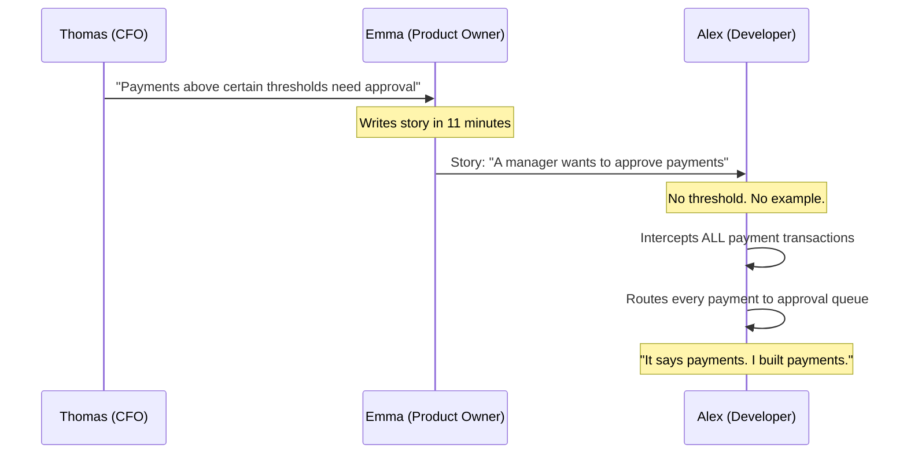

# Mirror, Mirror — Who Wrote It Wrong?

It is 9:47 on a Tuesday morning. The FinTrack payment platform has been live for three years. Today, it is processing zero transactions per minute.

In the operations room, 400 approval requests have arrived since 8:00. Every single payment — a €12 coffee subscription, a €7.50 parking fee, a €3 app store charge — is waiting for a manager to click *approve* before it can be processed.

Thomas, the CFO, calls Emma. Emma calls Alex. Alex opens the ticket.

*The ticket says exactly what he built.*

> Prequels
> - [The Team](../00_prequels/03_create-business-heroes.md)
> - [The Villains](../00_prequels/04_create-business-villains.md)

## Scene: The feature request — one paragraph, zero examples

Three weeks ago, Thomas sent Emma a Slack message at 8:23 PM.

*"Hey Emma, we had an audit finding last quarter. Payments above certain thresholds need manager approval before processing. Can we get this into the next sprint?"*

Emma was already preparing tomorrow's sprint planning. She had six other stories to finish. She wrote the story in 11 minutes.

> **Quest** Create quest
>
> | id | name                    | description                                                                | status      |
> |----|-------------------------|----------------------------------------------------------------------------|-------------|
> | 10 | Implement Approval Flow | Add manager approval step before payments are processed                    | IN_PROGRESS |

> **Quest** Assign to hero
>
> | hero | quest                   |
> |------|-------------------------|
> | Alex | Implement Approval Flow |

> **Quest** Status is
>
> | quest                   | expectedStatus |
> |-------------------------|----------------|
> | Implement Approval Flow | IN_PROGRESS    |

The story read:

```
Title: Payment Approval Workflow

As a manager,
I want to approve payments before they are processed,
so that large or unusual transactions can be reviewed.

Acceptance Criteria:
- A manager can approve a pending payment
- An approved payment proceeds to processing
- A rejected payment is cancelled
```

There was no example. No threshold. No definition of *which* payments. No mention of €10,000.

Thomas never reviewed the story. He was in Dubai at a conference.

## Scene: Alex builds what the story says

Alex picks up the ticket on Monday morning. He reads the acceptance criteria three times. He has questions — but the sprint ends Friday, and asking Emma means waiting until Wednesday when she's back from her product strategy workshop.

He implements what the story says.



> **Monster** Monster is alive
>
> | name                    |
> |-------------------------|
> | Documentation Drift     |
> | Missing Acceptance Test |

By Wednesday, the feature is built. By Thursday, it passes Alex's unit tests. By Friday afternoon, it is merged.

On Monday morning, it goes live with the weekly deployment.

## Scene: The Tuesday morning crisis

By 8:15, the operations team starts receiving approval requests.

By 9:00, there are 127 of them. The team assumes it is a test environment leak and ignores it.

By 9:47, there are 400 requests. Revenue processing has effectively stopped.

> **Quest** Complete quest
>
> | hero | quest                   |
> |------|-------------------------|
> | Alex | Implement Approval Flow |

> **Quest** Status is
>
> | quest                   | expectedStatus |
> |-------------------------|----------------|
> | Implement Approval Flow | COMPLETED      |

The ticket is green. The story is done. The system is broken.

Thomas calls Emma. *"Why is every payment in an approval queue?"*
Emma calls Alex. *"Why did you put every payment through approval?"*
Alex opens the ticket. *"Because that is what the story says."*

> **Fight** Attack fails
>
> | attacker | defender                | weapon              | result |
> |----------|-------------------------|---------------------|--------|
> | Alex     | Documentation Drift     | Code                | FAILED |
> | Emma     | Missing Acceptance Test | Requirements Review | FAILED |
> | Thomas   | Documentation Drift     | Sprint Feedback     | FAILED |

The feature is correct. The story is wrong. But nobody can agree on which, because there is no verified example to point to.

## Scene: The mirror's verdict

Thomas opens the documentation and reads it aloud in the post-mortem.

*"As a manager, I want to approve payments before they are processed."*

*"That,* says Thomas, *does not say every payment. It says large transactions. The audit finding was about transactions above ten thousand euros."*

*"That,* says Alex, *is not written in the story."*

> **Monster** Monster is alive
>
> | name          |
> |---------------|
> | Blame Culture |

Emma is caught in the middle. She wrote the story. She did not write it wrong — she wrote it the way Thomas described it verbally. But she also did not ask for a concrete example. She also did not say *which* payments.

> **Fight** Attack fails
>
> | attacker | defender      | weapon          | result |
> |----------|---------------|-----------------|--------|
> | Stefan   | Blame Culture | Architecture Review | FAILED |
> | Emma     | Blame Culture | Story Revision  | FAILED |

The platform is patched in two hours. The feature is restricted to payments above €10,000. The operations team clears the approval queue by lunchtime.

The post-mortem report is filed. The root cause listed: *"Ambiguous acceptance criteria."*

That is the polite way of saying: the mirror showed everyone what they wanted to see.

## Moral of the Story

**A user story without a concrete, verified example is not a specification. It is an invitation to be misunderstood.**

Thomas had a precise business need: *payments above €10,000 need approval*. He communicated it as a paragraph. Emma transcribed it as a sentence. Alex implemented it as an absolute rule.

At each step, information was lost. At no step was the result verified against the original intent.

If the story had contained a single example table:

| paymentAmount | requiresApproval |
|---------------|------------------|
| €7.50         | false            |
| €500.00       | false            |
| €10,001.00    | true             |

— then Alex would have built the right thing. Maria would have verified it. Thomas would have approved it. And it would have been Tuesday morning, processing transactions, completely unremarkably.

- ✗ One ambiguous sentence cost four hours of revenue processing
- ✗ Three people were right. Three people were wrong. Nobody could prove it.
- ✗ The mirror in documentation reflects what each reader brings to it

*The post-mortem ends. The next sprint begins.*
*The next story is already one sentence long.*
