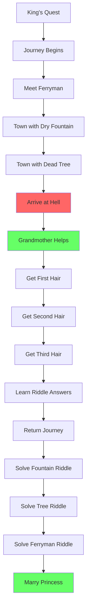

# Chapter 3: The Devil with the Three Golden Hairs

## Overview

This chapter tells the tale of a **Lucky Youth** who must journey to hell itself and pluck three golden hairs from the Devil's head to win the princess's hand.

The story demonstrates **advanced living documentation patterns**:
- ✅ **Multi-stage quests** - Complex quest chains with dependencies
- ✅ **Helper characters** - Multiple heroes collaborating
- ✅ **Sub-quests** - Side missions that aid the main goal
- ✅ **Skill reuse** - Same plot methods across different stories
- ✅ **Narrative complexity** - Rich storytelling with validation

## The Tale

A boy is born under a lucky star, prophesied to marry the king's daughter. The jealous king sends him on an impossible quest: journey to hell and bring back three golden hairs from the Devil himself. Along the way, he must solve riddles for a ferryman, discover why a tree no longer bears golden apples, and learn why a fountain has run dry.

With the help of the Devil's grandmother, can the Lucky Youth succeed where all others have failed?

## Plot Usage

This story **reuses** plots from Chapter 2, demonstrating framework power:
- **Hero** - Multiple collaborating characters
- **Monster** - The fearsome Devil  
- **Quest** - Complex multi-stage mission
- **Fight** - Indirect defeat through cunning
- **Achievement** - Recognition for a legendary quest

## Story Structure

*A journey through hell and back, armed only with luck and a grandmother's love...*
