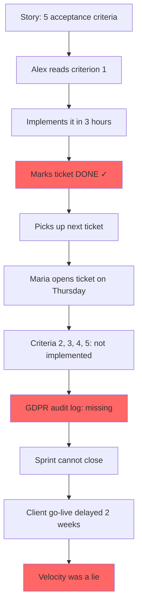

# The Developer Who Was Always Done

## Overview

Alex has the highest velocity on the team. Every sprint, his column fills with green tickets before Wednesday. Stefan calls him a machine. Thomas quotes his throughput in leadership meetings.

There is just one problem. When Maria opens the green tickets, she finds that *done* and *finished* are not the same thing.

This is the story of a GDPR audit log, a customer registration feature, and a sprint that could not close — because the fastest developer on the team had already moved on to the next ticket before the first one was actually done.

## The Problem

A user registration story has five acceptance criteria. Alex reads the first one, implements it in three hours, and marks the ticket done. The other four criteria — including a legally mandatory GDPR audit log — are untouched.

Maria discovers this on the Thursday before sprint review. The sprint cannot close. The feature cannot ship. And because the audit log was a contractual obligation to a new enterprise client, it is now also a legal exposure.

## What Goes Wrong

- ✗ A ticket is marked done after one of five criteria is implemented
- ✗ The team's velocity report looks excellent — it is fiction
- ✗ The QA engineer finds the gap 48 hours before the sprint review
- ✗ A GDPR audit log requirement is missed — a compliance violation, not just a bug
- ✗ The enterprise client's go-live is delayed by two weeks
- ✗ Nobody noticed earlier because nobody verified coverage before marking done

## Story Structure

*"Done!" said Alex, and moved to the next ticket.*
*Four acceptance criteria watched him leave.*
