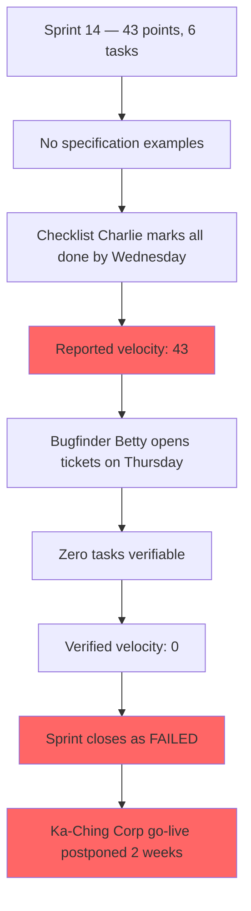

# The Developer Who Was Always Done

## Meet the cast

---

### ✅ Checklist Charlie — Senior Developer

**His superpower:** Fastest ticket closure rate on the team. Six tickets by Wednesday, every sprint.

**His weakness:** Reads the first acceptance criterion, builds it, marks the ticket DONE. The remaining four criteria — including the ones with legal implications — wait patiently in the ticket description while Charlie picks up the next task.

> *"I built what the ticket said. Criterion one. That's the registration feature."*

---

### 🔍 Bugfinder Betty — QA Engineer

**Her superpower:** Reads every acceptance criterion. Tests every edge case. Finds the gaps every time.

**Her weakness:** She is brought in at the end of the sprint, after the tickets are green and the demo is scheduled. By then, the damage is already done.

> *"Four criteria are missing. One of them is the GDPR audit log. That's not a bug — that's a compliance violation."*

---

### 🏗️ Blueprint Ben — Tech Lead

**His superpower:** Architecture diagrams that could win awards. Code reviews that catch every pattern violation.

**His weakness:** Reviews the implementation against the code quality checklist, not the specification. A partial implementation that compiles cleanly passes Blueprint Ben's review.

> *"The code is clean. The architecture is solid. I didn't check the acceptance criteria."*

---

### 🪞 Mirror Mike — CFO

**His weakness:** Opens the velocity chart on Friday. Sees 43 points. Sends a congratulatory message to the channel. Does not look at the QA report until the Ka-Ching Corp call at 4 PM.

> *"The burndown chart shows a perfect sprint. Why is the go-live delayed?"*

---

## The Problem

Sprint 14: 43 story points planned, 43 reported as done — by Wednesday. No specification examples existed for any task. When Bugfinder Betty returned from sick leave on Thursday, she found zero tasks she could verify. The sprint closed as FAILED.

Ka-Ching Corp's go-live, scheduled for that Friday, was postponed two weeks.

## Story Structure

*The burndown chart was a work of fiction.*
*The sprint review was not.*
