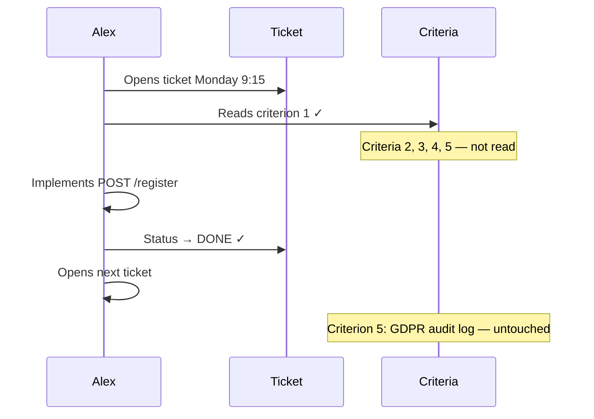

# The Developer Who Was Always Done

Sprint 14 has the highest velocity in FinTrack history. Forty-three story points delivered. The burndown chart looks like a textbook example. Thomas sends a message to the engineering channel: *"Great work team 🚀"*.

Maria has not opened a single ticket yet. She has been sick all week.

She comes back on Thursday.

> Prequels
> - [The Team](../00_prequels/03_create-business-heroes.md)
> - [The Villains](../00_prequels/04_create-business-villains.md)

## Scene: The user registration story — five criteria, all important

On Monday morning, Emma walks into sprint planning with a story she spent three days writing. It is the most complete story she has ever written. Five acceptance criteria, each one clear, each one necessary.

The enterprise client InnoConnect has signed a contract. Their go-live depends on this feature being ready on Friday.

> **Quest** Create quest
>
> | id | name                        | description                                                                           | status      |
> |----|-----------------------------|---------------------------------------------------------------------------------------|-------------|
> | 11 | Implement User Registration | Register new users: validation, email confirmation, duplicate check, and GDPR logging | IN_PROGRESS |

> **Quest** Assign to hero
>
> | hero | quest                       |
> |------|-----------------------------|
> | Alex | Implement User Registration |

> **Quest** Status is
>
> | quest                       | expectedStatus |
> |-----------------------------|----------------|
> | Implement User Registration | IN_PROGRESS    |

The story reads:

```
Title: Customer User Registration

Acceptance Criteria:
1. A new user can register with a valid email address and password
2. Email addresses must be validated — invalid formats are rejected
3. A confirmation email is sent to the user after successful registration
4. Duplicate registrations with the same email address are rejected
5. Every registration attempt — successful or failed — is written to the GDPR audit log
```

Criterion 5 has a note: *"Required for InnoConnect contract compliance — see Section 4.2 of the MSA."*

## Scene: Alex reads the first line

Alex picks up the ticket at 9:15 on Monday morning. He scans the criteria. His eyes land on criterion 1.

*"A new user can register with a valid email address and password."*

That is the core of it, he thinks. He opens his IDE. By noon, he has a working registration endpoint. By 2 PM, he has unit tests passing. By 3 PM, the ticket is done.

He moves to the next ticket. Then the one after that. By Wednesday, he has closed six tickets. Stefan calls him a machine.



> **Monster** Monster is alive
>
> | name                    |
> |-------------------------|
> | Partial Implementation  |
> | Missing Acceptance Test |

The ticket is green. The implementation is real. And four acceptance criteria are still waiting, quietly, for someone to notice.

## Scene: Maria comes back on Thursday

Maria returns from sick leave at 8:00 on Thursday morning. The sprint review is tomorrow at 2 PM. She has 19 green tickets to verify.

She opens the user registration ticket first — it is the highest-priority item for InnoConnect.

She reads all five criteria. She opens her test suite. She starts checking.

By 9:30, she has found four gaps.

> **Quest** Complete quest
>
> | hero | quest                       |
> |------|-----------------------------|
> | Alex | Implement User Registration |

> **Quest** Status is
>
> | quest                       | expectedStatus |
> |-----------------------------|----------------|
> | Implement User Registration | COMPLETED      |

The ticket is marked COMPLETED. But what Maria finds is this:

| Criterion | Status | Finding |
|-----------|--------|---------|
| 1. Register with email and password | ✅ Implemented | Works correctly |
| 2. Reject invalid email formats     | ❌ Missing     | `test@` is accepted without error |
| 3. Send confirmation email          | ❌ Missing     | No email is sent after registration |
| 4. Reject duplicate registrations   | ❌ Missing     | Same email can register unlimited times |
| 5. GDPR audit log                   | ❌ Missing     | Zero audit entries written — contract violation |

> **Fight** Attack fails
>
> | attacker | defender               | weapon      | result |
> |----------|------------------------|-------------|--------|
> | Maria    | Partial Implementation | Test Report | FAILED |

Maria reopens the ticket. She adds her findings in a comment. She tags Alex and Emma.

Emma reads the comment at 10:15. She calls Thomas.

*"The InnoConnect go-live is at risk."*

## Scene: The sprint review — forty-three points, nothing to ship

At 2 PM on Friday, the team sits down for the sprint review. The burndown chart is perfect. The velocity is the highest in three months.

Thomas asks about the user registration feature. He has a call with InnoConnect at 4 PM.

> **Monster** Monster is alive
>
> | name                    |
> |-------------------------|
> | Blame Culture           |
> | Partial Implementation  |

> **Fight** Attack fails
>
> | attacker | defender               | weapon          | result |
> |----------|------------------------|-----------------|--------|
> | Stefan   | Partial Implementation | Code Review     | FAILED |
> | Thomas   | Partial Implementation | Sprint Feedback | FAILED |

Maria explains the four missing criteria. She explains criterion 5 — the GDPR audit log — and its legal significance.

Alex says: *"I built the registration. I thought that was the ticket."*

Emma says: *"All five criteria were in the ticket."*

Stefan checks the merge request. The code is clean, well-tested, and covers exactly one fifth of the requirement.

The sprint cannot be closed with a compliant feature. The InnoConnect go-live is moved to the following sprint. The client is unhappy. They had planned their own internal launch event around the date.

Thomas cancels the 4 PM call. He sends an apology email instead.

## Moral of the Story

**Velocity measures how many tickets were closed. It does not measure how much of each ticket was actually delivered.**

Alex did not cut corners out of laziness. He cut corners out of habit — a habit that had never been caught before, because Maria had always been there to find the gaps before they reached the sprint review.

This sprint, she was not.

- ✗ One out of five criteria delivered ≠ done
- ✗ A GDPR audit log is not optional — it is a contractual and legal obligation
- ✗ Green tickets without verified coverage are technical debt wearing a completion badge
- ✗ The enterprise client experienced the gap as a broken promise

*Sprint 15 begins. Alex picks up his first ticket.*
*He reads the first criterion.*
*It sounds clear.*
