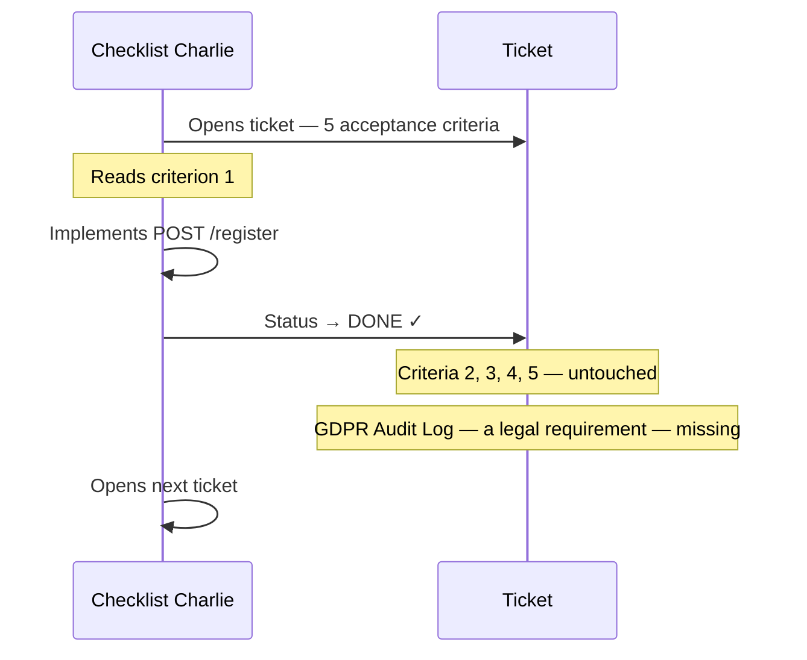

# The Developer Who Was Always Done

Sprint 14 has the highest velocity in FinTrack history. 43 story points. The burndown chart hits zero on Wednesday afternoon. Thomas sends a congratulatory message to the engineering channel.

Bugfinder Betty has been sick all week. She comes back on Thursday.

> Prequels
> - [The Team](../00_prequels/03_create-business-heroes.md)
> - [The Risks](../00_prequels/04_create-business-villains.md)

## Scene: Sprint 14 kicks off with an important goal

InnoConnect's enterprise go-live depends on the User Registration feature being complete by Friday. The story has five acceptance criteria — including a GDPR audit log that is a contractual obligation.

> **Sprint** Plan sprint
>
> | id | name      | plannedPoints | goal                                           |
> |----|-----------|---------------|------------------------------------------------|
> | 1  | Sprint 14 | 43            | User Registration ready for InnoConnect go-live |

> **Sprint** Add task *Sprint 14*
>
> | task                            | points |
> |---------------------------------|--------|
> | User Registration               | 13     |
> | Email Validation                | 5      |
> | Confirmation Email              | 5      |
> | Duplicate Registration Check    | 5      |
> | GDPR Audit Log                  | 8      |
> | Password Reset Flow             | 7      |

## Scene: The specification has no examples — for any task

Before a single line of code is written, the warning signs are already there.

> **Specification** Has no examples
>
> | feature                         |
> |---------------------------------|
> | User Registration               |
> | Email Validation                |
> | Confirmation Email              |
> | Duplicate Registration Check    |
> | GDPR Audit Log                  |

No concrete examples. No shared understanding of what "done" looks like for any criterion. The developers will fill in the gaps themselves — each in their own way.

> **Risk** Risk is active
>
> | name                    |
> |-------------------------|
> | Missing Acceptance Test |
> | Partial Implementation  |

## Scene: Checklist Charlie reads the first line

Monday 9:15. Checklist Charlie opens the User Registration ticket. He reads criterion 1: *"A new user can register with a valid email address and password."*

He nods. He opens his IDE. By noon he has a working endpoint. By 3 PM the ticket is green.

By Wednesday afternoon, Checklist Charlie has closed all six tickets.

> **Sprint** Mark task done
>
> | task                            |
> |---------------------------------|
> | User Registration               |
> | Email Validation                |
> | Confirmation Email              |
> | Duplicate Registration Check    |
> | GDPR Audit Log                  |
> | Password Reset Flow             |

> **Sprint** Reported velocity is
>
> | sprint    | expected |
> |-----------|----------|
> | Sprint 14 | 43       |

Blueprint Ben reviews the pull requests. The code is clean. The architecture is solid. He does not cross-reference the acceptance criteria.

## Scene: Bugfinder Betty comes back on Thursday

Betty returns from sick leave at 8:00. She opens the six green tickets. She reads every acceptance criterion. She starts testing.

By 9:30, she has found the gaps:

| Task                         | Criteria | Implemented | Missing                              |
|------------------------------|----------|-------------|--------------------------------------|
| User Registration            | 5        | 1           | Email validation, email confirmation, duplicate check, GDPR log |
| Email Validation             | 3        | 0           | All three criteria not implemented   |
| Confirmation Email           | 2        | 0           | Endpoint exists, no email is sent    |
| Duplicate Registration Check | 2        | 0           | Same email registers unlimited times |
| GDPR Audit Log               | 3        | 0           | Zero audit entries written           |
| Password Reset Flow          | 4        | 0           | Not implemented                      |

> **Sprint** Task is not verified
>
> | task                            |
> |---------------------------------|
> | User Registration               |
> | Email Validation                |
> | Confirmation Email              |
> | Duplicate Registration Check    |
> | GDPR Audit Log                  |
> | Password Reset Flow             |

Betty reopens every ticket. She tags Checklist Charlie, Blueprint Ben, and Mirror Mike.

## Scene: The sprint review — a perfect chart, an impossible demo

Friday 2 PM. The sprint review begins. Mirror Mike has a call with InnoConnect at 4 PM.

> **Attempt** Fails
>
> | teamMember    | risk                   | approach        | result |
> |---------------|------------------------|-----------------|--------|
> | Blueprint Ben | Partial Implementation | Code Review     | FAILED |
> | Mirror Mike   | Partial Implementation | Sprint Feedback | FAILED |

> **Risk** Risk is active
>
> | name          |
> |---------------|
> | Blame Culture |

Checklist Charlie: *"I built the registration. I thought that was the ticket."*
Pinky Princess: *"All five criteria were in the ticket."*
Blueprint Ben checks the merge request. Clean code. One fifth of the requirements.

> **Sprint** Close sprint
>
> | sprint    |
> |-----------|
> | Sprint 14 |

> **Sprint** Verified velocity is
>
> | sprint    | expected |
> |-----------|----------|
> | Sprint 14 | 0        |

> **Sprint** Sprint status is
>
> | sprint    | expected |
> |-----------|----------|
> | Sprint 14 | FAILED   |

Mirror Mike cancels the 4 PM call with InnoConnect.

## Moral of the Story

**Velocity measures tickets closed. It does not measure criteria delivered.**

Sprint 14 reported 43 points. Sprint 14 delivered 0 verified points. The burndown chart was a perfect line to zero — in the wrong direction.

The GDPR audit log was not a nice-to-have. It was a contractual obligation. Nobody noticed it was missing, because nobody had verified the specification before closing the ticket.

- ✗ 43 reported points → 0 verified points → sprint FAILED
- ✗ A green ticket with one criterion implemented is not done — it is a lie with good intentions
- ✗ The GDPR audit log was a legal requirement hiding inside a "completed" ticket

*Sprint 15 begins. Checklist Charlie picks up his first ticket.*
*He reads the first criterion. It sounds clear.*
