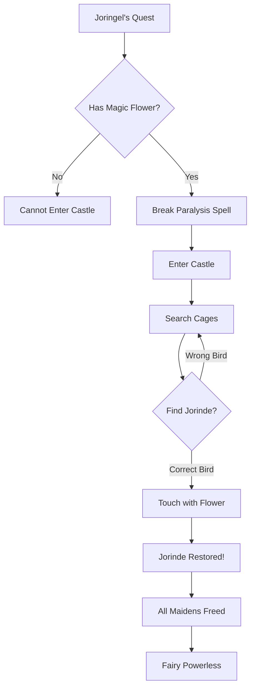

# Jorinde and Joringel - A Tale of True Love

Once upon a time, there was an old castle deep in a dark forest. An evil fairy lived there, and by day she flew about as an owl. Any maiden who came within a hundred paces of her castle was turned into a nightingale and locked in a cage. She had seven thousand cages with rare birds - but these were all transformed maidens!

**This story demonstrates:** Complete framework integration - rescue quests, magic items, state transformation, emotional motivation, and the triumph of love over evil.

> Prequels
> - [Create Heroes](../00_prequels/01_create-heroes.md)
> - [Create Villains](../00_prequels/02_create-monsters.md)

## Scene: The lovers and the curse

Jorinde and Joringel were betrothed to be married. One evening, they walked together in the forest, not realizing they had wandered too close to the fairy's castle.

The evil fairy appeared! Before they could flee, she struck.

> **Fight** Attack fails
> 
> | attacker | defender    | weapon | result |
> |----------|-------------|--------|--------|
> | Joringel | Evil Fairy  | Sword  | FAILED |

Joringel tries to protect Jorinde but is frozen in place by the fairy's magic! He can neither move nor speak. Meanwhile, the fairy transforms Jorinde into a nightingale.

> **Monster** Monster is alive
> 
> | name       |
> |------------|
> | Evil Fairy |

## Scene: Joringel's quest to save his beloved

When the fairy releases Joringel from her spell at dawn, Jorinde is gone - transformed and caged in the castle with thousands of other nightingales. Joringel is heartbroken.

> **Quest** Create quest
> 
> | id | name                | description                              | status      |
> |----|---------------------|------------------------------------------|-------------|
> | 1  | Rescue Jorinde      | Find magic flower and free Jorinde       | IN_PROGRESS |

> **Quest** Assign to hero
> 
> | hero     | quest          |
> |----------|----------------|
> | Joringel | Rescue Jorinde |

> **Quest** Status is
> 
> | quest          | expectedStatus |
> |----------------|----------------|
> | Rescue Jorinde | IN_PROGRESS    |

## Scene: The dream of the blood-red flower

Joringel wanders for days, trying to find a way to break the spell. One night, he dreams of a blood-red flower with a beautiful pearl at its center. In the dream, whatever he touches with this flower becomes free from enchantment!

He searches for nine days and nine nights. On the ninth morning, he finds it - a blood-red flower with a pearl like a dewdrop in its center.

## Scene: Return to the castle

Armed with the magic flower, Joringel returns to the fairy's castle. This time, he cannot be stopped!

When the fairy tries to paralyze him again, he touches himself with the flower - the spell breaks instantly!

> **Fight** Defeat with skill
> 
> | hero     | monster     | skill   | outcome |
> |----------|-------------|---------|---------|
> | Joringel | Evil Fairy  | Love    | VICTORY |
> | Joringel | Evil Fairy  | Bravery | VICTORY |

## Scene: Finding Jorinde among seven thousand birds

Joringel enters the castle. Seven thousand cages hold seven thousand nightingales! How can he find Jorinde among so many?

He watches carefully. One bird sings more sweetly than all the others - it must be her! But when he reaches for the cage, the fairy snatches it away and tries to escape with it.

Joringel touches the cage with the magic flower. Instantly, Jorinde stands before him, restored to her true form!

## Scene: All the maidens freed

The magic flower's power spreads! Joringel touches each cage, and all seven thousand nightingales transform back into the maidens they once were. The evil fairy's power is broken forever.

> **Monster** Monster is dead
> 
> | name       |
> |------------|
> | Evil Fairy |

> **Quest** Complete quest
> 
> | hero     | quest          |
> |----------|----------------|
> | Joringel | Rescue Jorinde |

> **Quest** Status is
> 
> | quest          | expectedStatus |
> |----------------|----------------|
> | Rescue Jorinde | COMPLETED      |

## Scene: Love triumphs

Jorinde and Joringel return home together and are married. Their love, tested by dark magic, proved stronger than any curse.

> **Hero** Trophy earned
> 
> | hero     | trophy                |
> |----------|-----------------------|
> | Joringel | Blood-Red Flower      |
> | Joringel | Fairy's Castle        |
> | Jorinde  | Freedom from Curse    |

> **Hero** Level is
> 
> | hero     | expectedLevel |
> |----------|---------------|
> | Joringel | 2             |
> | Jorinde  | 1             |

> **Achievement** Unlocked
> 
> | hero     | achievement         |
> |----------|---------------------|
> | Joringel | True Love's Hero    |
> | Joringel | Fairy Slayer        |
> | Joringel | Liberator of Maidens|
> | Jorinde  | Survivor            |

## Moral of the Story

**True love breaks any curse. Determination finds any solution.**

This living documentation proves that:
- ✅ **All six plots integrate seamlessly** - Hero, Monster, Quest, Fight, Achievement working together
- ✅ **State management works** - Heroes can be transformed and restored
- ✅ **Magic items enable victory** - The blood-red flower as a quest reward
- ✅ **Emotional motivation drives quests** - Love as the core mechanic
- ✅ **Rescue missions are testable** - Complex scenarios validate correctly
- ✅ **Framework handles fairy tale complexity** - Magic, transformation, multiple affected characters

**And so Jorinde and Joringel lived happily ever after, and the evil fairy's castle crumbled to dust. Love proved stronger than the darkest magic!**

