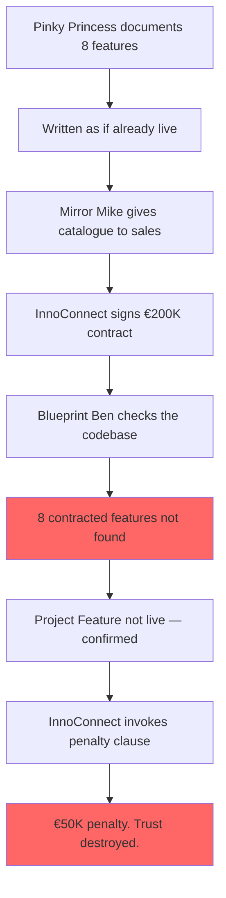

# The Product Owner Who Promised the Stars

## Meet the cast

---

### 👑 Pinky Princess — Product Owner

**Her superpower:** Can describe a feature so clearly, so completely, and so confidently that you would swear it already exists.

**Her weakness:** Documents features as if they are already built. She writes in the present tense. The catalogue says *"the system supports."* The system does not support. The catalogue is beautiful. The system is incomplete.

> *"Of course it's in the documentation. I wrote it myself."*

---

### 🏗️ Blueprint Ben — Tech Lead

**His weakness:** Trusted the product catalogue. Never cross-referenced it against the codebase.

> *"We have a design document from 2022. That's not the same as an implementation."*

---

### 🪞 Mirror Mike — CFO

**His weakness:** Sent the product catalogue to the sales team and called it the feature list.

> *"I need to call InnoConnect. They're going to invoke the penalty clause."*

---

## The Problem

Pinky Princess has been product owner for four years. Her Confluence space has 847 pages. New hires are told to read it in their first week.

The product catalogue lists 8 features that InnoConnect specifically contracted for.

None of them were ever built.

## Story Structure

*"The catalogue says we have it."*
*"The codebase says we do not."*
*"The contract says that costs fifty thousand euros."*
