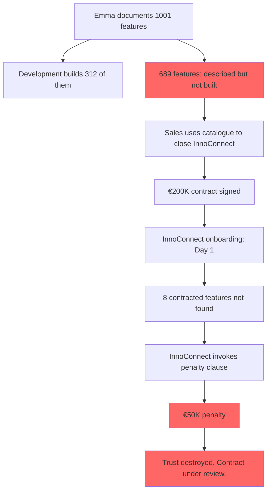

# The Product Owner Who Promised the Stars

## Overview

Emma is exceptional at her job. She has been product owner at FinTrack Solutions for four years. Her Confluence space is the most visited page in the company. New hires are told to read it before their first sprint.

It describes a world-class expense management platform with 1001 documented capabilities.

The system has 312 of them.

Nobody noticed — until InnoConnect's enterprise IT team arrived for their onboarding.

## The Problem

Emma documents features as she imagines them — clearly, confidently, and ahead of delivery. She intends the development team to build them eventually. She does not mark them as "planned" or "not yet built". She writes them as if they exist, because in her mind they already do.

The sales team uses the documentation to close deals. The customers sign contracts based on it.

When InnoConnect arrived with a €200,000 contract and a list of features they had specifically selected, they found that eight of them did not exist.

## What Goes Wrong

- ✗ The product catalogue describes features that were never built
- ✗ No distinction between "live", "in development", and "planned"  
- ✗ Sales uses the catalogue as a feature promise — because it reads like one
- ✗ An enterprise client signs a contract based on described capabilities
- ✗ Day one of onboarding reveals the gap — publicly, in front of the client's IT team
- ✗ The penalty clause in the contract applies: €50,000

## Story Structure

*"The catalogue says we have it,"* said Emma.*
*"The system says we do not,"* said the auditor.
