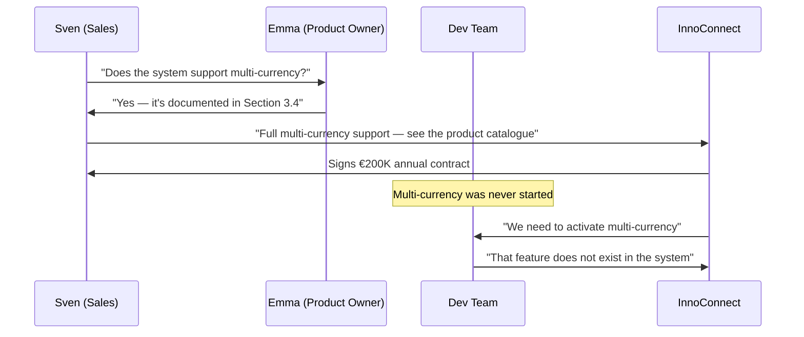

# The Product Owner Who Promised the Stars

Emma opens Confluence on Monday morning and starts writing. This is her favourite part of the week.

She has a clear vision for the FinTrack platform. In her head, she can see exactly what it will be in two years — the multi-currency support, the advanced permission system, the partner integration API, the configurable audit trail. She writes them down. In detail. With user stories, business rules, and edge cases.

It feels like building the product. In a way, she believes it is.

> Prequels
> - [The Team](../00_prequels/03_create-business-heroes.md)
> - [The Villains](../00_prequels/04_create-business-villains.md)

## Scene: The catalogue grows faster than the codebase

Over four years, Emma has documented everything she has ever envisioned for FinTrack. Her Confluence space has 847 pages. New hires spend their first week reading it.

The sales team calls it *the bible*.

> **Quest** Create quest
>
> | id | name                         | description                                             | status      |
> |----|------------------------------|---------------------------------------------------------|-------------|
> | 12 | Publish Feature Catalogue    | Document all product capabilities for sales and clients | IN_PROGRESS |

> **Quest** Assign to hero
>
> | hero  | quest                     |
> |-------|---------------------------|
> | Emma  | Publish Feature Catalogue |

Emma documents:

| Feature                          | Status in Documentation | Status in System        |
|----------------------------------|-------------------------|-------------------------|
| Payment processing               | ✅ Described             | ✅ Built and live        |
| Expense categorisation           | ✅ Described             | ✅ Built and live        |
| Basic reporting dashboard        | ✅ Described             | ⚠️ Built — partially    |
| Multi-currency support           | ✅ Described as live     | ❌ Never started         |
| Advanced user permission system  | ✅ Described as live     | ❌ Design doc from 2022  |
| Configurable audit trail export  | ✅ Described as live     | ❌ Ticket never pulled   |
| Partner integration API          | ✅ Described as live     | ❌ No ticket exists      |
| Bulk payment import              | ✅ Described as live     | ❌ Prototype abandoned   |

The documentation does not say "planned". It does not say "coming soon". It uses the present tense throughout.

*The FinTrack platform supports multi-currency transactions across 40 countries.*

> **Quest** Complete quest
>
> | hero  | quest                     |
> |-------|---------------------------|
> | Emma  | Publish Feature Catalogue |

> **Quest** Status is
>
> | quest                     | expectedStatus |
> |---------------------------|----------------|
> | Publish Feature Catalogue | COMPLETED      |

The documentation is excellent. It is also, in large parts, fiction.

> **Monster** Monster is alive
>
> | name                  |
> |-----------------------|
> | Unimplemented Feature |
> | Documentation Drift   |

## Scene: The sales call that sealed the deal

Sven, the enterprise sales director, has been working InnoConnect for eight months. They are a logistics company with 12,000 employees across 14 countries. They process expenses in six currencies.

Sven opens Emma's documentation during the final demo. He finds exactly what InnoConnect needs.

*Multi-currency support — yes. Partner integration API — yes. Advanced permissions for regional managers — yes.*

He quotes the documentation directly in the proposal.

InnoConnect signs a €200,000 annual contract. Thomas celebrates in the all-hands meeting. It is the largest enterprise deal in FinTrack history.

> **Quest** Create quest
>
> | id | name                         | description                                                         | status      |
> |----|------------------------------|---------------------------------------------------------------------|-------------|
> | 13 | InnoConnect Onboarding       | Activate all contracted features for InnoConnect enterprise account | IN_PROGRESS |

> **Quest** Assign to hero
>
> | hero   | quest                   |
> |--------|-------------------------|
> | Stefan | InnoConnect Onboarding  |

## Scene: Day one of onboarding

InnoConnect's IT team arrives for the onboarding call. They have a list. They worked from Emma's documentation to prepare it.

Stefan opens the codebase.

The first feature on InnoConnect's list is multi-currency support.

Stefan searches the codebase. He finds a branch from 18 months ago, never merged, with a partial currency conversion prototype. It covers two currencies. InnoConnect needs six.

> **Fight** Attack fails
>
> | attacker | defender              | weapon      | result |
> |----------|-----------------------|-------------|--------|
> | Stefan   | Unimplemented Feature | Code Search | FAILED |
> | Stefan   | Documentation Drift   | Code Review | FAILED |

He moves to the next feature: the advanced user permission system. He finds a design document from 2022. No implementation.

Partner integration API. No ticket. No code. No plan.

Configurable audit trail export. One ticket, created fourteen months ago, never assigned to a sprint, never pulled.

> **Quest** Status is
>
> | quest                   | expectedStatus |
> |-------------------------|----------------|
> | InnoConnect Onboarding  | IN_PROGRESS    |

By noon, Stefan has confirmed: eight of the features InnoConnect specifically contracted are not in the system.

## Scene: The penalty clause

InnoConnect's legal team is not surprised. They had included a delivery clause in the contract.

> **Monster** Monster is alive
>
> | name          |
> |---------------|
> | Audit Failure |
> | Blame Culture |

> **Fight** Attack fails
>
> | attacker | defender      | weapon                   | result |
> |----------|---------------|--------------------------|--------|
> | Emma     | Audit Failure | Feature Roadmap Promises | FAILED |
> | Thomas   | Audit Failure | Executive Explanation    | FAILED |
> | Thomas   | Audit Failure | Sales Proposal Revision  | FAILED |

InnoConnect invokes the penalty clause. Section 7.3 of the Master Services Agreement: *"Failure to deliver contracted features within 60 days of contract commencement — €50,000 penalty per tier."*

FinTrack pays €50,000. The InnoConnect relationship is placed under a formal remediation plan. Sven's commission is clawed back. Thomas calls an emergency leadership meeting.

Emma sits in that meeting and explains that she documented what she *planned* for the product. She genuinely believed the development team would build it.

Nobody told her that the documentation had become a sales instrument. Nobody told the sales team that it described ambitions, not deliverables. Nobody ever verified that the catalogue reflected reality.

## Moral of the Story

**Documentation that describes a planned future as a present fact is not product vision. It is an unverified promise — and unverified promises have contract clauses.**

Emma did not deceive anyone deliberately. She was doing what product owners do: thinking ahead, writing it down, sharing the vision. But without a process that links documentation to verified delivery, the catalogue became a liability the moment it was handed to a sales team.

The sales team did not lie. They quoted the documentation. The documentation looked authoritative — because it was written by the product owner, in the product wiki, with diagrams and business rules and everything that makes a page look true.

Nobody checked whether it was.

- ✗ Present-tense documentation of unbuilt features creates false confidence
- ✗ A feature catalogue used in sales is a contract — whether it says so or not
- ✗ €200K of revenue became a €50K penalty because no one verified delivery
- ✗ Eight missing features cost more than any sprint could recover

*Emma opens Confluence on the following Monday.*
*She starts writing.*
*The next feature already exists — on the page.*
