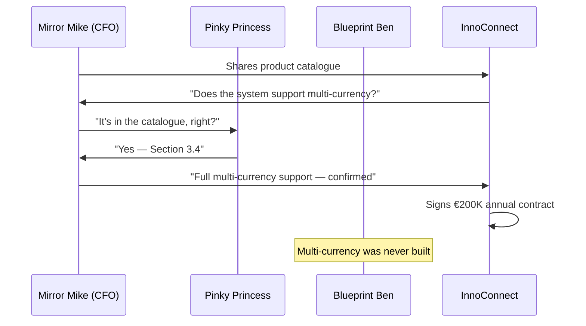

# The Product Owner Who Promised the Stars

Pinky Princess opens Confluence on Monday morning. This is her favourite part of the week.

In her head, she can see the complete FinTrack platform — the multi-currency module, the advanced permissions system, the partner API. She writes them down. In detail. In the present tense. *"The system supports."*

> Prequels
> - [The Team](../00_prequels/03_create-business-heroes.md)
> - [The Risks](../00_prequels/04_create-business-villains.md)

## Scene: The FinTrack project and its product catalogue

> **Project** Create project
>
> | id | name    | goal                                    |
> |----|---------|-----------------------------------------|
> | 1  | FinTrack| Enterprise expense management platform  |

> **Project** Project exists
>
> | name    |
> |---------|
> | FinTrack|

Pinky Princess has been writing for four years. The catalogue is comprehensive, detailed, and written entirely in the present tense.

## Scene: Two features that actually exist

These two features were built. They have been tested. They have specification examples.

> **Specification** Add example
>
> | feature             | given                       | expected                       |
> |---------------------|-----------------------------|--------------------------------|
> | Payment Processing  | payment request submitted   | transaction processed in 2s    |
> | Expense Categories  | expense item created        | auto-categorised by merchant   |

> **Project** Feature is live
>
> | project | feature             |
> |---------|---------------------|
> | FinTrack| Payment Processing  |
> | FinTrack| Expense Categories  |

## Scene: Eight features that exist only in the catalogue

These features appear in the product documentation. They do not appear in the codebase. They have no specification examples, because they were never built.

> **Project** Feature not live
>
> | project | feature                          |
> |---------|----------------------------------|
> | FinTrack| Multi-Currency Support           |
> | FinTrack| Advanced Permission System       |
> | FinTrack| Partner Integration API          |
> | FinTrack| Configurable Audit Trail Export  |
> | FinTrack| Bulk Payment Import              |
> | FinTrack| Multi-Entity Consolidation       |
> | FinTrack| SSO Integration                  |
> | FinTrack| Custom Approval Workflows        |

> **Risk** Risk is active
>
> | name                  |
> |-----------------------|
> | Unimplemented Feature |
> | Documentation Drift   |

Eight features. Zero verified examples. All of them in the catalogue. None of them in the system.

## Scene: Sales closes the InnoConnect deal

Mirror Mike shares the catalogue with the sales team. Sales uses it in every enterprise pitch.

InnoConnect signs a €200,000 annual contract. Mirror Mike announces it in the all-hands.

## Scene: Blueprint Ben opens the codebase

On day one of InnoConnect onboarding, Blueprint Ben is asked to activate the contracted features.

> **Attempt** Fails
>
> | teamMember    | risk                  | approach    | result |
> |---------------|-----------------------|-------------|--------|
> | Blueprint Ben | Unimplemented Feature | Code Search | FAILED |
> | Blueprint Ben | Documentation Drift   | Code Review | FAILED |

Blueprint Ben searches the codebase for multi-currency. He finds a branch from 18 months ago with a partial prototype for two currencies. InnoConnect needs six.

He checks each feature. No implementation for any of them. The design documents exist. The code does not.

## Scene: The penalty clause

> **Risk** Risk is active
>
> | name          |
> |---------------|
> | Audit Failure |
> | Blame Culture |

> **Attempt** Fails
>
> | teamMember     | risk          | approach                 | result |
> |----------------|---------------|--------------------------|--------|
> | Pinky Princess | Audit Failure | Feature Roadmap Promises | FAILED |
> | Mirror Mike    | Audit Failure | Executive Explanation    | FAILED |

InnoConnect invokes Section 7.3 of the contract: *€50,000 penalty for failure to deliver contracted features.* FinTrack pays. Mirror Mike cancels two team lunches.

Pinky Princess explains: *"I documented what I planned for the product. I expected the team to build it."*

Nobody told her the documentation had become a sales instrument. Nobody connected the catalogue to the codebase. Nobody verified whether what was written matched what was running.

## Moral of the Story

**A feature without a verified specification example is not a feature. It is a plan that never happened.**

The product catalogue was not a lie. It was a vision document treated as evidence. The moment it was handed to a sales team and used in a contract, every unbuilt feature became a broken promise.

- ✗ Eight features documented as live → zero verified examples → all eight unbuilt
- ✗ `Feature not live` is not a nice assertion — it is a contract risk
- ✗ €200K revenue became €50K penalty because nobody ran `Feature is live` before the pitch

*Pinky Princess opens Confluence the following Monday.*
*She starts a new page. She writes in the present tense.*
