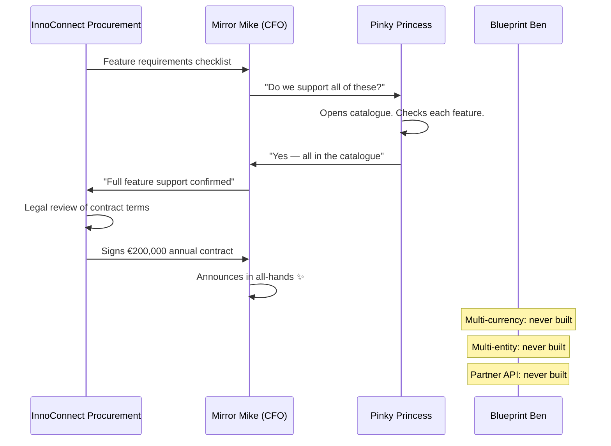

# The Product Owner Who Promised the Stars

Monday morning. 8:47 AM. Pinky Princess opens Confluence.

This is her favourite part of the week. The office is quiet. Her coffee is hot. The cursor blinks in a new page. She can see the entire FinTrack platform in her head — fully formed, fully functional, everything connected. She just needs to write it down.

She types: *"The system supports multi-currency transactions across six major currencies."*

She pauses. She nods. She moves on to the next feature.

> Prequels
> - [The Team](../00_prequels/03_create-business-heroes.md)
> - [The Risks](../00_prequels/04_create-business-villains.md)

---

## Scene: The FinTrack product catalogue — four years in the making

Pinky Princess has been Product Owner at FinTrack Solutions for four years. In those four years, she has written 847 Confluence pages. She has documented every feature request, every stakeholder conversation, every roadmap item, every idea that came up in a sprint retrospective.

The product catalogue is the first thing new joiners are told to read. It is comprehensive, detailed, and written entirely in the present tense. It describes features that existed in version 1.0. It describes features that are coming in the next quarter. It describes features that were on a roadmap that was abandoned eighteen months ago. Everything is written with equal confidence in the same present tense.

The catalogue says the system *supports*. It does not say the system *plans to support* or *once supported* or *will support when we get the funding*. It says *supports*.

> **Project** Create project
>
> | id | name     | goal                                   |
> |----|----------|----------------------------------------|
> | 1  | FinTrack | Enterprise expense management platform |

> **Project** Project exists
>
> | name     |
> |----------|
> | FinTrack |

There is one thing the product catalogue does not contain. Anywhere. For any feature. A single concrete, verifiable example of the feature working.

---

## Scene: The two features that actually exist

Two features in the FinTrack platform have been built, tested, deployed, and used by real customers. They have specification examples because they were built from user stories that contained concrete acceptance criteria. They work.

> **Specification** Add example
>
> | feature            | given                     | expected                    |
> |--------------------|---------------------------|-----------------------------|
> | Payment Processing | payment request submitted | transaction processed in 2s |
> | Expense Categories | expense item created      | auto-categorized by merchant|

When you run the Payment Processing story against the system, it passes. The transaction is processed in under two seconds. The example is true.

> **Project** Feature is live
>
> | project  | feature            |
> |----------|--------------------|
> | FinTrack | Payment Processing |
> | FinTrack | Expense Categories |

This is what *"the system supports"* looks like when it is real. There is a passing example. You can run it. It proves the feature exists in the running system.

---

## Scene: Eight features that live only in the catalogue

The catalogue also lists these eight features. They appear in exactly the same format as Payment Processing. Same present tense. Same confident language. Same professional documentation.

> **Project** Feature not live
>
> | project  | feature                         |
> |----------|---------------------------------|
> | FinTrack | Multi-Currency Support          |
> | FinTrack | Advanced Permission System      |
> | FinTrack | Partner Integration API         |
> | FinTrack | Configurable Audit Trail Export |
> | FinTrack | Bulk Payment Import             |
> | FinTrack | Multi-Entity Consolidation      |
> | FinTrack | SSO Integration                 |
> | FinTrack | Custom Approval Workflows       |

Eight features. Zero passing specification examples. All of them in the catalogue. None of them in the system.

Multi-Currency Support has a two-page Confluence document explaining the supported currencies, the conversion mechanism, and the rounding rules. It was written in Q2 last year as part of a roadmap planning session. The development work was scoped, estimated, and then deprioritised when the GDPR compliance sprint overran.

The documentation remained. Nobody deleted it. Nobody marked it as *"not yet implemented."* It just sat there, in the present tense, waiting to be discovered.

> **Risk** Risk is active
>
> | name                  |
> |-----------------------|
> | Unimplemented Feature |
> | Documentation Drift   |

---

## Scene: InnoConnect comes knocking

InnoConnect is a B2B payments processor with 3,400 clients across eleven European countries. They are looking for an expense management platform that handles multi-currency and multi-entity consolidation — both critical for their clients who operate across borders.

Their procurement team sends a feature requirements checklist to three vendors. FinTrack is one of them.

Mirror Mike receives the checklist. He forwards it to Pinky Princess with a two-line message: *"Can you confirm we support all of these? Big opportunity."*

Pinky Princess opens the checklist. She opens the product catalogue in a second tab. She goes through each item:

- Multi-Currency Support — *yes, Section 3.4*
- Multi-Entity Consolidation — *yes, Section 7.1*
- Partner Integration API — *yes, Section 8.2*
- Custom Approval Workflows — *yes, Section 5.6*

She replies to Mirror Mike: *"Yes, we support all of these."*

She closes both tabs. She opens a new Confluence page. She starts writing.

---

## Scene: The contract is signed

InnoConnect signs a €200,000 annual contract. Mirror Mike announces it in the all-hands meeting. He specifically thanks Pinky Princess for the quality of the product catalogue, which was *"instrumental in closing the deal."*

The contract includes a standard enterprise clause: Section 7.3. Failure to deliver contracted features results in a €50,000 penalty per quarter of delay.

Nobody reads Section 7.3 until much later.

---

## Scene: Day one of onboarding — Blueprint Ben opens the codebase

InnoConnect's project manager sends the onboarding kickoff agenda on a Monday morning. Item one: activate contracted features in the InnoConnect sandbox environment.

Blueprint Ben is responsible for the technical onboarding. He receives the feature list. He opens the codebase. He starts searching.

Multi-Currency Support: he searches for *"currency conversion"* in the codebase. He finds a branch called `feature/multi-currency-v1` that was last committed eighteen months ago. The branch has code for EUR and GBP conversion. InnoConnect needs six currencies. The branch was never merged.

> **Attempt** Fails
>
> | teamMember    | risk                  | approach    | result |
> |---------------|-----------------------|-------------|--------|
> | Blueprint Ben | Unimplemented Feature | Code Search | FAILED |
> | Blueprint Ben | Documentation Drift   | Code Review | FAILED |

He moves to Multi-Entity Consolidation. He searches the codebase. Nothing. He checks Jira — there is an epic from 2023 titled *"Multi-Entity"* with twelve tickets. All twelve are in the *"Backlog"* column. None of them have ever been started.

Partner Integration API: there is a design document in Confluence. It describes the API endpoints in detail. He searches the codebase for the endpoint paths. They do not exist.

Blueprint Ben works through all eight features. The pattern is the same each time: documentation exists, code does not. The catalogue describes a system that was planned. The codebase contains the system that was built.

He sends Mirror Mike a Slack message at 4:47 PM: *"We have a problem."*

---

## Scene: The penalty clause

The call with InnoConnect's legal team is on Thursday morning. Mirror Mike is in the room. So is Blueprint Ben, Pinky Princess, and the FinTrack legal counsel.

> **Risk** Risk is active
>
> | name          |
> |---------------|
> | Audit Failure |
> | Blame Culture |

InnoConnect's legal team is polite and methodical. They go through each contracted feature. For each one, they ask Blueprint Ben to confirm it is available in the sandbox environment. For each one, Blueprint Ben says it is not.

> **Attempt** Fails
>
> | teamMember     | risk          | approach                 | result |
> |----------------|---------------|--------------------------|--------|
> | Pinky Princess | Audit Failure | Feature Roadmap Promises | FAILED |
> | Mirror Mike    | Audit Failure | Executive Explanation    | FAILED |

Mirror Mike explains that the features are on an accelerated roadmap and will be delivered in Q1. Pinky Princess says the documentation accurately reflected the product direction. InnoConnect's legal team listens carefully.

Then they cite Section 7.3.

€50,000. Payable within thirty days.

FinTrack pays. Mirror Mike cancels two company events. He does not cancel the all-hands where he announced the contract — that was last month and the recording is still on the intranet.

Pinky Princess says, in the post-mortem: *"I documented what I planned for the product. I expected the team to build it. I did not know the catalogue had been used as a feature confirmation."*

Nobody told her. She is right that nobody told her. She is also the person who wrote *"the system supports"* when the system did not support.

---

## Moral of the Story

**A feature without a verified specification example is not a feature. It is a plan that has not happened yet.**

The product catalogue was not malicious. It was a vision document that was treated as evidence. The moment it entered a sales conversation and then a contract, every unbuilt feature became a breach of promise.

The difference between Payment Processing (which exists) and Multi-Currency Support (which does not) is one thing: a passing specification example. `Feature is live` returns true for one. `Feature not live` returns true for the other.

If someone had run those two assertions before the sales pitch, they would have known immediately which features they could sell and which they could not.

- ✗ Eight features documented as live → zero verified examples → all eight unbuilt
- ✗ `Feature not live` is not a developer concern — it is a contract risk
- ✗ €200K revenue became €50K penalty because nobody ran `Feature is live` before the pitch

*Monday morning. 8:47 AM.*
*Pinky Princess opens Confluence.*
*She types: "The system supports—"*
*She stops.*
*She opens the codebase.*
