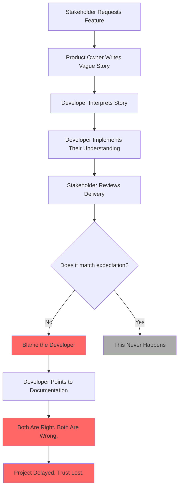

# The Stakeholder Asks the Mirror

## Overview

This chapter tells the story of a **Stakeholder** who uses the project documentation as his mirror — and always asks it the same question: *"Mirror, mirror on the wall, who writes the best stories of all?"*

The answer, of course, is never the developer.

The story shows what happens when requirements are vague, assumptions are never validated, and blame replaces responsibility.

## The Problem

A feature is requested. A story is written — briefly, informally, with good intentions. The developer reads it and builds what they understand. The stakeholder reviews the result and immediately asks: *why did you not do what I said?*

Nobody checks the story. Nobody validates the expectation. The mirror only reflects blame.

## What Goes Wrong

- ✗ Requirements are written without concrete examples
- ✗ No one validates that the developer's understanding matches the intent
- ✗ The system is delivered — but not what was expected
- ✗ The stakeholder blames the developer
- ✗ The developer points to the story as proof they did their job
- ✗ Trust breaks down, and the next sprint begins in the same fog

## Story Structure

*"Mirror, mirror, who wrote it wrong?"*
*"Everyone did — and no one knows."*
