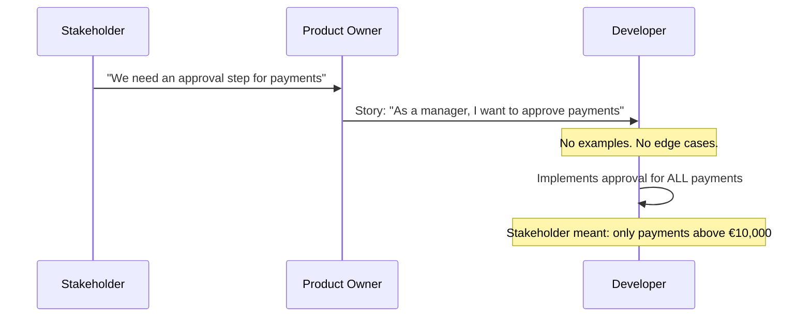

# The Stakeholder Asks the Mirror

Once upon a project, there was a Stakeholder who trusted only one thing: the documentation.

Every sprint review, he would open the requirements document and ask the same question: *"Mirror, mirror — does the system do what I asked?"* And every sprint review, the answer was: *"Not quite."*

But the mirror never blamed itself.

> Prequels
> - [Create Business Heroes](../00_prequels/03_create-business-heroes.md)
> - [Create Business Villains](../00_prequels/04_create-business-villains.md)

## Scene: The feature request arrives

The Stakeholder sends a message to the Product Owner. The message is one paragraph long. It describes a business need — urgently, without examples, without edge cases.

The Product Owner creates a user story. It fits on half a card. It says what the feature should do, but not how, and not under which conditions.

> **Quest** Create quest
>
> | id | name                     | description                                              | status      |
> |----|--------------------------|----------------------------------------------------------|-------------|
> | 10 | Implement Approval Flow  | Add approval step before payment is processed            | IN_PROGRESS |

> **Quest** Assign to hero
>
> | hero      | quest                    |
> |-----------|--------------------------|
> | Developer | Implement Approval Flow  |

> **Quest** Status is
>
> | quest                    | expectedStatus |
> |--------------------------|----------------|
> | Implement Approval Flow  | IN_PROGRESS    |

## Scene: The developer reads the mirror

The Developer opens the story. It says: *"As a manager, I want to approve payments before they are processed."*

There are no examples. There is no definition of "manager". There is no description of what happens if nobody approves. There is no timeout. There is no mention of which payment types require approval.

The Developer asks no questions. The sprint is short. They build what they understand.

> **Monster** Monster is alive
>
> | name                    |
> |-------------------------|
> | Documentation Drift     |
> | Missing Acceptance Test |

## Scene: The delivery — and the mirror's verdict

The Developer marks the quest complete. Every payment now requires manual approval. The Stakeholder tests the feature in the demo.

> **Quest** Complete quest
>
> | hero      | quest                    |
> |-----------|--------------------------|
> | Developer | Implement Approval Flow  |

> **Quest** Status is
>
> | quest                    | expectedStatus |
> |--------------------------|----------------|
> | Implement Approval Flow  | COMPLETED      |

The Stakeholder is not pleased. He opens the documentation. He opens the mirror.

*"I said approval step. I did not say every single payment. I meant payments above ten thousand euros. This is completely wrong."*

The Developer opens the story. *"It says: I want to approve payments. It does not say above ten thousand. I built exactly what was written."*

> **Fight** Attack fails
>
> | attacker    | defender                | weapon              | result |
> |-------------|-------------------------|---------------------|--------|
> | Developer   | Documentation Drift     | Code                | FAILED |
> | Stakeholder | Missing Acceptance Test | Requirements Review | FAILED |

Both are right. Both are wrong. The story had no example. The developer made an assumption. The stakeholder never validated. The mirror showed only what each person wanted to see.

## Scene: Blame culture takes hold

The retrospective is uncomfortable. The Stakeholder says the Developer should have asked. The Developer says the requirements should have been clearer. The Product Owner says there was no time.

> **Monster** Monster is alive
>
> | name            |
> |-----------------|
> | Blame Culture   |

The feature is rebuilt. The sprint is extended. The delivery is late. Nobody knows what the rule should have been, because it was never written down with an example.

> **Fight** Attack fails
>
> | attacker    | defender      | weapon          | result |
> |-------------|---------------|-----------------|--------|
> | Tech Lead   | Blame Culture | Process Meeting | FAILED |

The Stakeholder closes the mirror. He will ask again next sprint.

## Moral of the Story

**A requirement without examples is not a requirement. It is a wish.**

When nobody can point to a concrete, verified example of what the system should do, every person sees their own reflection in the documentation — and blames the others for looking different.

- ✗ Vague requirements produce valid-but-wrong implementations
- ✗ Without executable examples, nobody can prove who was right
- ✗ Blame fills the space where precision should live
- ✗ The mirror reflects what each person brings to it

*The next sprint begins. The Stakeholder opens the documentation. "Mirror, mirror..."*
