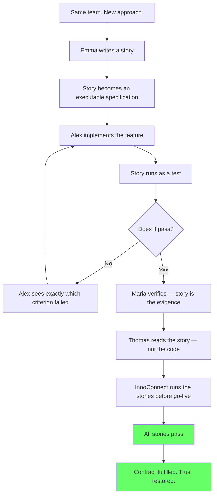

# The Day Documentation Became Evidence

## Overview

Six months after the InnoConnect penalty. Six months after the Tuesday morning payment crisis. Six months after Sprint 14's fictional velocity.

The same team. The same company. Different rules.

FinTrack has adopted True Doc Tales. Stories are no longer written and forgotten — they are written and *run*. Every acceptance criterion is a test. Every product claim is verified before it is published. Every ticket can only be closed when the story passes.

InnoConnect has offered FinTrack a second chance: a new module, a new contract, a new start. This time, they want proof — not documentation.

This is the story of how a team that broke trust in three different ways learned to rebuild it in one: by making every story they wrote tell the truth.

## The Transformation

| Before True Doc Tales              | After True Doc Tales                            |
|------------------------------------|-------------------------------------------------|
| Stories describe what might exist  | Stories describe what is verified to exist      |
| Done means the developer said so   | Done means all criteria are green               |
| The catalogue is a vision document | The catalogue is a record of proven behaviour   |
| Stakeholders read documentation    | Stakeholders run documentation                  |
| Gaps discovered at audit           | Gaps discovered at commit                       |

## Story Structure

*The documentation does not just describe what the system does.*
*It proves it.*
