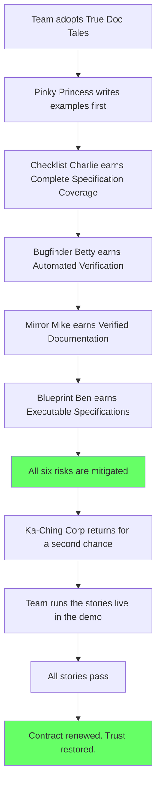

# The Day Documentation Became Evidence

## The same team. Six months later. Different rules.

After the Ka-Ching Corp penalty, after Sprint 14's fictional velocity, after the Tuesday morning payment crisis — the team made one decision:

**Every story we write will be a test we can run.**

---

### 👑 Pinky Princess — now writes examples first

Before True Doc Tales: *"The system supports multi-currency."*
After True Doc Tales: *"Given a GBP account, when a EUR payment is made, then the amount is converted at the current rate."*

She no longer writes features as if they exist. She writes specifications that prove they do.

---

### ✅ Checklist Charlie — now closes tickets differently

Before True Doc Tales: Criterion 1 done → ticket green.
After True Doc Tales: All criteria green → ticket green. He cannot close a ticket with failing specification examples. The framework enforces it.

---

### 🔍 Bugfinder Betty — now verifies sprints, not post-mortems

Before True Doc Tales: Found defects after the sprint review.
After True Doc Tales: The specification examples are verified on every commit. She focuses on edge cases the stories don't yet cover.

---

### 🪞 Mirror Mike — now asks for evidence, not summaries

Before True Doc Tales: Looked at the velocity chart.
After True Doc Tales: Runs the stories for the features he cares about. Pass means proven.

---

### 🏗️ Blueprint Ben — now reviews specs alongside code

Before True Doc Tales: Reviewed code quality.
After True Doc Tales: Reviews code AND specification coverage. A clean implementation of the wrong behaviour does not pass his review.

---

## The transformation

| Before                                      | After                                          |
|---------------------------------------------|------------------------------------------------|
| Features documented as if they exist        | Features proven by passing specification examples |
| Done = developer said so                    | Done = all specification examples are green    |
| Product catalogue is a vision document      | Product catalogue is a verified evidence record |
| Velocity = story points reported            | Velocity = story points verified               |
| Gaps discovered at audit or customer call   | Gaps discovered at the next commit             |

## Story Structure

*Ka-Ching Corp asked: "Can you show us the tests that prove it works?"*
*This time, the answer was yes.*
