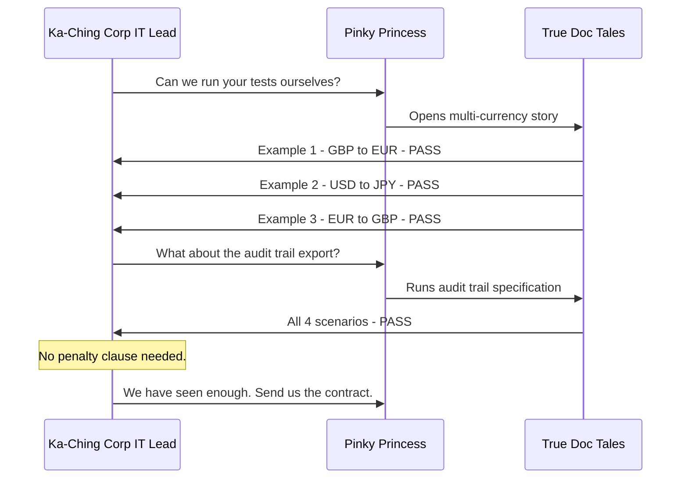

# The Day Documentation Became Evidence

Six months ago, Mirror Mike was on a call with Ka-Ching Corp's legal team authorizing a €50,000 penalty payment.

Today he is on a call with their CEO. They are discussing expanding the contract to include four new country markets.

The difference between those two calls is not a different team, a new process, or a management restructure. It is a single rule that Blueprint Ben proposed in a retrospective five months ago:

*"Every story we write is a test we can run."*

> Prequels
> - [The Team](../00_prequels/03_create-business-heroes.md)
> - [The Risks](../00_prequels/04_create-business-villains.md)

---

## Scene: The same team — six months later

Six months after the Ka-Ching Corp penalty. Same six people. Same six risks. One new rule.

> **Team Member** Create team member
>
> | id | name              | role             |
> |----|-------------------|------------------|
> | 10 | Pinky Princess    | Product Owner    |
> | 11 | Checklist Charlie | Developer        |
> | 12 | Bugfinder Betty   | QA Engineer      |
> | 13 | Mirror Mike       | CFO              |
> | 14 | Blueprint Ben     | Tech Lead        |

Every risk that caused the three incidents is still active. They were acknowledged in the post-mortem. They were never resolved.

> **Risk** Create risk
>
> | id | name                    | severity | mitigation                      |
> |----|-------------------------|----------|---------------------------------|
> | 10 | Documentation Drift     | HIGH     | Executable Specifications       |
> | 11 | Missing Acceptance Test | HIGH     | Automated Verification          |
> | 12 | Blame Culture           | EXTREME  | Shared Accountability           |
> | 13 | Unimplemented Feature   | EXTREME  | Living Documentation            |
> | 14 | Audit Failure           | EXTREME  | Verified Documentation          |
> | 15 | Partial Implementation  | HIGH     | Complete Specification Coverage |

> **Risk** Risk is active
>
> | name                    |
> |-------------------------|
> | Documentation Drift     |
> | Missing Acceptance Test |
> | Blame Culture           |
> | Unimplemented Feature   |
> | Audit Failure           |
> | Partial Implementation  |

---

## Scene: The retrospective nobody wanted to have

The retrospective after the Ka-Ching Corp penalty was scheduled for a Tuesday afternoon. Attendance was mandatory. The room had six people and the atmosphere of a courtroom.

Three incidents had been formally reviewed in the previous three months. The payment platform going down after Sprint 11. The failed Sprint 14 with zero verified velocity. The €50,000 penalty from the unbuilt catalogue features. Each incident had a different surface cause. Each had a different owner in the post-mortem report.

Blueprint Ben had been looking at all three. He had been looking at the pattern underneath them.

Every failure happened in the gap between what was written and what was verified. The Slack message became a story without examples. The story became a ticket without specification coverage. The ticket became a closed item without QA confirmation. The catalogue became a sales instrument without proof of implementation.

Three incidents. One gap. Nobody had been verifying whether what was written matched what was running.

> **Ticket** Create ticket
>
> | id | title                | description                                                   | status      |
> |----|----------------------|---------------------------------------------------------------|-------------|
> | 20 | Adopt True Doc Tales | Integrate executable specifications into the delivery process | IN_PROGRESS |

---

## Scene: Blueprint Ben makes his proposal

Blueprint Ben spoke for twelve minutes. He brought a diagram. He explained what True Doc Tales was: a framework where markdown stories contain executable step calls, and the steps are bound to Java methods that run against the actual system.

The key idea: if the story runs as a test, the gap between documentation and reality becomes visible at the moment it appears — not six months later at a penalty review.

Mirror Mike asked: *"If Pinky Princess had written the multi-currency page as a True Doc Tales story, what would have happened?"*

Blueprint Ben: *"The story would have failed. The `Feature is live` step would have returned false. She would have seen it the moment she ran it."*

Mirror Mike: *"And the payment approval threshold?"*

Blueprint Ben: *"The story would have required a concrete example table. Without the table, the story cannot be run. The absence of examples is not something you discover at 9:47 on a Tuesday — it is something you discover when you try to write the story."*

The team agreed. Quietly, not enthusiastically. Change rarely arrives that way.

> **Ticket** Assign to developer
>
> | developer     | ticket               |
> |---------------|----------------------|
> | Blueprint Ben | Adopt True Doc Tales |

> **Sprint** Plan sprint
>
> | id | name      | plannedPoints | goal                              |
> |----|-----------|---------------|-----------------------------------|
> | 5  | Sprint 17 | 34            | True Doc Tales for all stories    |

> **Sprint** Add task *Sprint 17*
>
> | task                 | points |
> |----------------------|--------|
> | Adopt True Doc Tales | 13     |
> | Backfill Specs       | 21     |

---

## Scene: Pinky Princess learns to write examples first

The first meeting Blueprint Ben had was with Pinky Princess. He showed her the difference between a sentence and a specification.

Before: *"The system supports multi-currency."* Present tense. No examples. Unverifiable. The gap lives here.

After: A table with three rows. Three concrete examples of input and expected output. Something that can be run.

> **Team Member** Grant skill
>
> | teamMember     | skill                     |
> |----------------|---------------------------|
> | Pinky Princess | Executable Specifications |
> | Pinky Princess | Living Documentation      |

> **Team Member** Has skill
>
> | teamMember     | skill                 |
> |----------------|-----------------------|
> | Pinky Princess | Executable Specifications |

That afternoon, Pinky Princess opened the product catalogue. She went through every feature. For each one, she asked: *do I have a passing example?* If yes, it stays. If no, it goes into a *"planned"* section — clearly labelled, never sold as current.

The catalogue shrinks from 1001 entries to 312. It is a long and painful afternoon. It is also the first afternoon in four years where every statement in the catalogue is true.

The approval threshold story — the one that caused the Tuesday payment crisis — now has three concrete examples. The examples are the specification. They are also the test.

> **Specification** Add example
>
> | feature                    | given               | expected               |
> |----------------------------|---------------------|------------------------|
> | Payment Approval Threshold | payment: €7.50      | approval: not required |
> | Payment Approval Threshold | payment: €500.00    | approval: not required |
> | Payment Approval Threshold | payment: €10,001.00 | approval: required     |

> **Specification** Has examples
>
> | feature                    |
> |----------------------------|
> | Payment Approval Threshold |

> **Specification** Example count is
>
> | feature                    | count |
> |----------------------------|-------|
> | Payment Approval Threshold | 3     |

If this story had existed before Sprint 11, Checklist Charlie would have had three rows to build against. Not a sentence. Not an interpretation. Three rows. The €7.50 coffee subscription would have gone straight through. No crisis.

> **Attempt** Succeeds with skill
>
> | teamMember     | risk                  | skill                | outcome  |
> |----------------|-----------------------|----------------------|----------|
> | Pinky Princess | Unimplemented Feature | Living Documentation | RESOLVED |

> **Risk** Risk is mitigated
>
> | name                  |
> |-----------------------|
> | Unimplemented Feature |

> **Achievement** Unlocked
>
> | hero           | achievement                     |
> |----------------|---------------------------------|
> | Pinky Princess | Curator of Proven Documentation |

---

## Scene: Checklist Charlie discovers what done actually means

The second conversation was with Checklist Charlie.

Blueprint Ben showed him what the Sprint 14 tickets looked like inside True Doc Tales. Each acceptance criterion becomes a specification step. Each specification step must have a passing example before the ticket can be closed. You cannot click DONE on a ticket where the specification examples are failing.

> **Team Member** Grant skill
>
> | teamMember        | skill                           |
> |-------------------|---------------------------------|
> | Checklist Charlie | Complete Specification Coverage |

> **Team Member** Has skill
>
> | teamMember        | skill                           |
> |-------------------|---------------------------------|
> | Checklist Charlie | Complete Specification Coverage |

The first time Checklist Charlie encountered this in practice, he was building the Email Validation feature. He implemented criterion one. He tried to close the ticket. The story failed at criterion two. He saw exactly which example was failing and why.

He fixed it. He tried again. Criterion three failed.

He fixed it. He tried again. All five examples passed. The ticket closed.

It took him twice as long as it would have taken before. Every criterion was actually implemented. On Wednesday of that sprint, he had fewer green tickets than usual. Every single green ticket was completely green.

> **Attempt** Succeeds with skill
>
> | teamMember        | risk                   | skill                           | outcome  |
> |-------------------|------------------------|---------------------------------|----------|
> | Checklist Charlie | Partial Implementation | Complete Specification Coverage | RESOLVED |

> **Risk** Risk is mitigated
>
> | name                   |
> |------------------------|
> | Partial Implementation |

> **Achievement** Unlocked
>
> | hero              | achievement             |
> |-------------------|-------------------------|
> | Checklist Charlie | Complete Implementation |

---

## Scene: Bugfinder Betty verifies the story, not the debris

The third change was to Bugfinder Betty's role in the sprint.

Before True Doc Tales: Betty was brought in at the end of the sprint, after the developer had marked everything done. Her job was to find what had been missed. She was good at it. She was very, very good at it. She found something in every sprint. This was treated as the normal state of affairs.

> **Team Member** Grant skill
>
> | teamMember      | skill                  |
> |-----------------|------------------------|
> | Bugfinder Betty | Automated Verification |

> **Team Member** Has skill
>
> | teamMember      | skill                  |
> |-----------------|------------------------|
> | Bugfinder Betty | Automated Verification |

After True Doc Tales: the specification examples run on every commit. The CI pipeline runs the stories. If a commit breaks an example, the build fails immediately. Betty does not discover the gap at the sprint review — the gap is visible on the developer's screen within seconds of the commit.

Betty now focuses on the cases that the stories don't cover yet. The edge cases. The security scenarios. The load behaviours. The things that require exploratory testing to discover. She is no longer cleaning up after partially implemented tickets.

She is, for the first time, doing the work she was hired to do.

> **Attempt** Succeeds with skill
>
> | teamMember      | risk                    | skill                  | outcome  |
> |-----------------|-------------------------|------------------------|----------|
> | Bugfinder Betty | Missing Acceptance Test | Automated Verification | RESOLVED |

> **Risk** Risk is mitigated
>
> | name                    |
> |-------------------------|
> | Missing Acceptance Test |

> **Achievement** Unlocked
>
> | hero            | achievement                  |
> |-----------------|------------------------------|
> | Bugfinder Betty | Guardian of Verified Quality |

---

## Scene: Mirror Mike reads stories instead of slide decks

The fourth change was what Mirror Mike looked at on Friday afternoons.

Before: Mirror Mike opened the sprint report. He looked at the velocity number. He read the summary paragraph Pinky Princess had written. He sent the congratulatory Slack message or the concerned Slack message, depending on the number.

> **Team Member** Grant skill
>
> | teamMember  | skill                  |
> |-------------|------------------------|
> | Mirror Mike | Verified Documentation |
> | Mirror Mike | Shared Accountability  |

> **Team Member** Has skill
>
> | teamMember  | skill                  |
> |-------------|------------------------|
> | Mirror Mike | Verified Documentation |

After: Mirror Mike opens the story book. He finds the stories for the features he cares about — the ones he will be asked about in client calls, the ones in Ka-Ching Corp's contract, the ones the sales team is using. He runs them. Green means the feature exists and has been proven this week. Red means there is a gap to address before the feature can be claimed.

He no longer needs to trust that someone has checked. He can check. The story is the evidence. Running it is the act of verification.

> **Attempt** Succeeds with skill
>
> | teamMember  | risk          | skill                  | outcome  |
> |-------------|---------------|------------------------|----------|
> | Mirror Mike | Audit Failure | Verified Documentation | RESOLVED |
> | Mirror Mike | Blame Culture | Shared Accountability  | RESOLVED |

> **Risk** Risk is mitigated
>
> | name          |
> |---------------|
> | Audit Failure |
> | Blame Culture |

> **Achievement** Unlocked
>
> | hero        | achievement                   |
> |-------------|-------------------------------|
> | Mirror Mike | Evidence-Based Decision Maker |

---

## Scene: Blueprint Ben reviews specifications alongside code

The fifth change was Blueprint Ben's code review process.

Before: he reviewed code quality — naming, architecture, patterns, exception handling. He was good at this. His reviews were thorough. They did not catch the Sprint 14 gaps because he was not looking at them.

> **Team Member** Grant skill
>
> | teamMember    | skill                     |
> |---------------|---------------------------|
> | Blueprint Ben | Executable Specifications |

> **Team Member** Has skill
>
> | teamMember    | skill                     |
> |---------------|---------------------------|
> | Blueprint Ben | Executable Specifications |

After: every pull request is reviewed against both the code and the specification. He opens the story file alongside the diff. He checks whether every specification example is covered by the implementation. A clean implementation of the wrong behaviour does not pass Ben's review any more.

He adds this to the team's Definition of Done: *"The specification story passes for all examples."* Six words. Three months overdue.

> **Attempt** Succeeds with skill
>
> | teamMember    | risk                | skill                     | outcome  |
> |---------------|---------------------|---------------------------|----------|
> | Blueprint Ben | Documentation Drift | Executable Specifications | RESOLVED |

> **Risk** Risk is mitigated
>
> | name                |
> |---------------------|
> | Documentation Drift |

> **Achievement** Unlocked
>
> | hero          | achievement                   |
> |---------------|-------------------------------|
> | Blueprint Ben | Architect of Trusted Delivery |

---

## Scene: Sprint 17 — the first honest sprint

Sprint 17 is not the most exciting sprint in FinTrack history. It is mostly technical work — integrating the framework, writing specification stories for existing features, backfilling examples for the product catalogue.

It finishes on Friday afternoon. Blueprint Ben runs the full story book. Every story passes.

> **Sprint** Mark task done
>
> | task                 |
> |----------------------|
> | Adopt True Doc Tales |
> | Backfill Specs       |

> **Sprint** Verify task
>
> | task                 |
> |----------------------|
> | Adopt True Doc Tales |
> | Backfill Specs       |

> **Ticket** Close ticket
>
> | developer     | ticket               |
> |---------------|----------------------|
> | Blueprint Ben | Adopt True Doc Tales |

> **Ticket** Ticket status is
>
> | ticket               | expectedStatus |
> |----------------------|----------------|
> | Adopt True Doc Tales | COMPLETED      |

> **Sprint** Close sprint
>
> | sprint    |
> |-----------|
> | Sprint 17 |

For the first time in FinTrack history, the reported velocity and the verified velocity are the same number.

> **Sprint** Reported velocity is
>
> | sprint    | expected |
> |-----------|----------|
> | Sprint 17 | 34       |

> **Sprint** Verified velocity is
>
> | sprint    | expected |
> |-----------|----------|
> | Sprint 17 | 34       |

> **Sprint** Sprint status is
>
> | sprint    | expected  |
> |-----------|-----------|
> | Sprint 17 | COMPLETED |

Mirror Mike does not send a congratulatory Slack message. He runs the story book himself. He sees 34 reported, 34 verified, every story green. He closes his laptop.

He sends one message: *"This is what done looks like."*

---

## Scene: Ka-Ching Corp returns — and asks to run the stories themselves

Three months later, Ka-Ching Corp calls again. They want to expand the contract. Before they sign, their IT lead asks a question nobody has asked before:

*"Can we run your tests? Not look at them — run them."*

Pinky Princess shares the story book with their IT team over a screen share. She opens the multi-currency specification.

> **Specification** Add example
>
> | feature        | given                    | expected                  |
> |----------------|--------------------------|---------------------------|
> | Multi-Currency | GBP account, EUR payment | converted at current rate |
> | Multi-Currency | USD account, JPY payment | converted at current rate |
> | Multi-Currency | EUR account, GBP payment | converted at current rate |

> **Specification** Has examples
>
> | feature        |
> |----------------|
> | Multi-Currency |

She runs it. All three examples pass. Ka-Ching Corp's IT lead watches the output.

The IT lead: *"Last time we had to take your word for it. This time we saw it run."*

> **Project** Create project
>
> | id | name     | goal                                   |
> |----|----------|----------------------------------------|
> | 1  | FinTrack | Enterprise expense management platform |

> **Project** Feature is live
>
> | project  | feature        |
> |----------|----------------|
> | FinTrack | Multi-Currency |

Ka-Ching Corp signs the renewal. The contract includes an expanded feature set. There is no Section 7.3 penalty clause. Their legal team reviewed the story book instead.

---

## Scene: The outcome — what changed and what proved it

The team did not change dramatically. They did not hire new people or replace the ones who caused the failures. The same Pinky Princess who wrote *"the system supports multi-currency"* in 2023 is the one writing specification examples in 2024. The same Checklist Charlie who implemented one criterion per ticket is the one who now runs the full story before closing. The same Mirror Mike who sent the congratulatory Slack message about the fictional velocity is the one who now runs the story book on Friday afternoons.

What changed was one rule, enforced by a framework: *a story is not true until it has been run and it has passed.*

| Before                                       | After                                           |
|----------------------------------------------|-------------------------------------------------|
| Sprint 14: 43 reported, 0 verified, FAILED   | Sprint 17: 34 reported, 34 verified, COMPLETED  |
| 8 unbuilt features, €50K penalty             | Every feature backed by passing examples        |
| Mirror Mike reads velocity numbers           | Mirror Mike runs specification stories          |
| Blame assigned in post-mortems               | Evidence available in sprint reviews            |
| Gaps discovered at audits or customer calls  | Gaps discovered at the next commit              |

> **Team Member** Trophy earned
>
> | teamMember        | trophy                           |
> |-------------------|----------------------------------|
> | Pinky Princess    | Product Catalogue of Truth       |
> | Checklist Charlie | Sprint with Zero False Positives |
> | Bugfinder Betty   | First-Time Quality Champion      |
> | Mirror Mike       | Evidence-Based Stakeholder       |
> | Blueprint Ben     | Architect of Trusted Delivery    |

---

## Moral of the Story

**Trust is not built by writing more documentation. It is built by proving what the documentation claims.**

Three incidents. One gap. A gap between what was written and what was verified. The gap existed because nobody had a way to make it visible — until the stories became tests.

The stories are not test scripts. They are not boring test automation output. They are readable narratives that tell the business story of the system. And they happen to also be executable proof of every claim they contain.

When Ka-Ching Corp asked *"can we run your tests?"*, Pinky Princess did not open a CI dashboard or share a test report. She opened a story. The story read like a human document. And it ran like evidence.

*The documentation stopped being a mirror.*
*It became proof.*
