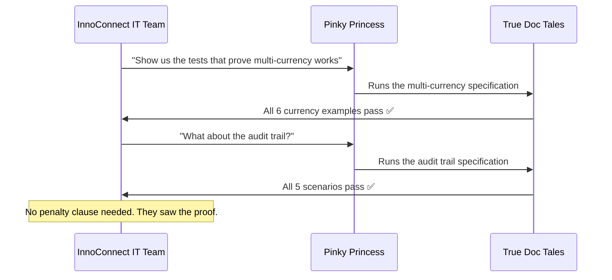

# The Day Documentation Became Evidence

Six months ago, Mirror Mike was on a call with InnoConnect's legal team authorising a €50,000 penalty.

Today he is on a call with their CEO. They are discussing expanding the contract.

The difference between those two calls is a single rule the team adopted five months ago: *every story we write is a test we can run*.

> Prequels
> - [The Team](../00_prequels/03_create-business-heroes.md)
> - [The Risks](../00_prequels/04_create-business-villains.md)

## Scene: The team adopts True Doc Tales

The meeting after the InnoConnect penalty was the hardest in FinTrack history. Three incidents. Three different surface causes. One pattern: every failure happened in the gap between what was written and what was verified.

Blueprint Ben proposed True Doc Tales. His argument: *"If the story runs as a test, the gap becomes visible the moment it appears — not six months later at a penalty review."*

> **Ticket** Create ticket
>
> | id | title                  | description                                                   | status      |
> |----|------------------------|---------------------------------------------------------------|-------------|
> | 20 | Adopt True Doc Tales   | Integrate executable specifications into the delivery process | IN_PROGRESS |

> **Ticket** Assign to developer
>
> | developer     | ticket               |
> |---------------|----------------------|
> | Blueprint Ben | Adopt True Doc Tales |

> **Sprint** Plan sprint
>
> | id | name      | plannedPoints | goal                         |
> |----|-----------|---------------|------------------------------|
> | 5  | Sprint 17 | 34            | True Doc Tales for all stories |

> **Sprint** Add task *Sprint 17*
>
> | task                 | points |
> |----------------------|--------|
> | Adopt True Doc Tales | 13     |
> | Backfill Specs       | 21     |

The team agrees. Quietly. Not enthusiastically — change rarely arrives that way. But they agree.

## Scene: Pinky Princess learns to write examples first

The first thing that changed was Pinky Princess's story structure.

Before: *"The system supports multi-currency."* (present tense, no examples, unverifiable)
After: A concrete example table for every feature claim.

> **Team Member** Grant skill
>
> | teamMember     | skill                     |
> |----------------|---------------------------|
> | Pinky Princess | Executable Specifications |
> | Pinky Princess | Living Documentation      |

> **Team Member** Has skill
>
> | teamMember     | skill                     |
> |----------------|---------------------------|
> | Pinky Princess | Executable Specifications |

She removes every unbuilt feature from the product catalogue. The catalogue shrinks from 1001 entries to 312. It is a painful afternoon. It is the first afternoon in four years where the catalogue is honest.

> **Specification** Add example
>
> | feature                         | given               | expected                 |
> |---------------------------------|---------------------|--------------------------|
> | Payment Approval Threshold      | payment: €7.50      | approval: not required   |
> | Payment Approval Threshold      | payment: €500.00    | approval: not required   |
> | Payment Approval Threshold      | payment: €10,001.00 | approval: required       |

> **Specification** Has examples
>
> | feature                    |
> |----------------------------|
> | Payment Approval Threshold |

> **Specification** Example count is
>
> | feature                    | count |
> |----------------------------|-------|
> | Payment Approval Threshold | 3     |

The approval threshold story that caused Tuesday's crisis now has three concrete examples. It is impossible to misinterpret.

> **Attempt** Succeeds with skill
>
> | teamMember     | risk                  | skill                 | outcome  |
> |----------------|-----------------------|-----------------------|----------|
> | Pinky Princess | Unimplemented Feature | Living Documentation  | RESOLVED |

> **Risk** Risk is mitigated
>
> | name                  |
> |-----------------------|
> | Unimplemented Feature |

> **Achievement** Unlocked
>
> | hero           | achievement                     |
> |----------------|---------------------------------|
> | Pinky Princess | Curator of Proven Documentation |

## Scene: Checklist Charlie discovers what done actually means

The second thing that changed was the definition of done.

A story in True Doc Tales is not done when the developer says so. It is done when all the specification examples are green.

> **Team Member** Grant skill
>
> | teamMember        | skill                           |
> |-------------------|---------------------------------|
> | Checklist Charlie | Complete Specification Coverage |

> **Team Member** Has skill
>
> | teamMember        | skill                           |
> |-------------------|---------------------------------|
> | Checklist Charlie | Complete Specification Coverage |

The first time Checklist Charlie tries to close a ticket with examples 2 through 5 unimplemented, the story fails at example 2. He sees the failure. He knows exactly what is missing. He implements it. The test passes.

On Wednesday of that sprint, he has fewer green tickets than usual. Every ticket that is green is completely green.

> **Attempt** Succeeds with skill
>
> | teamMember        | risk                   | skill                           | outcome  |
> |-------------------|------------------------|---------------------------------|----------|
> | Checklist Charlie | Partial Implementation | Complete Specification Coverage | RESOLVED |

> **Risk** Risk is mitigated
>
> | name                   |
> |------------------------|
> | Partial Implementation |

> **Achievement** Unlocked
>
> | hero              | achievement             |
> |-------------------|-------------------------|
> | Checklist Charlie | Complete Implementation |

## Scene: Bugfinder Betty verifies the story, not the debris

The third thing that changed was Bugfinder Betty's role in the sprint.

> **Team Member** Grant skill
>
> | teamMember      | skill                  |
> |-----------------|------------------------|
> | Bugfinder Betty | Automated Verification |

> **Team Member** Has skill
>
> | teamMember      | skill                  |
> |-----------------|------------------------|
> | Bugfinder Betty | Automated Verification |

Before: Betty arrived at the end of the sprint and found what the developers had missed.
After: The specification examples run on every commit. Betty focuses on the edge cases the stories don't yet cover.

> **Attempt** Succeeds with skill
>
> | teamMember      | risk                    | skill                  | outcome  |
> |-----------------|-------------------------|------------------------|----------|
> | Bugfinder Betty | Missing Acceptance Test | Automated Verification | RESOLVED |

> **Risk** Risk is mitigated
>
> | name                    |
> |-------------------------|
> | Missing Acceptance Test |

> **Achievement** Unlocked
>
> | hero            | achievement                |
> |-----------------|----------------------------|
> | Bugfinder Betty | Guardian of Verified Quality |

## Scene: Mirror Mike reads stories instead of slide decks

The fourth thing that changed was what Mirror Mike looked at on Fridays.

> **Team Member** Grant skill
>
> | teamMember  | skill                  |
> |-------------|------------------------|
> | Mirror Mike | Verified Documentation |
> | Mirror Mike | Shared Accountability  |

> **Team Member** Has skill
>
> | teamMember  | skill                  |
> |-------------|------------------------|
> | Mirror Mike | Verified Documentation |

Before: Mirror Mike read velocity charts.
After: Mirror Mike runs the stories for the features he cares about. Pass means proven. Fail means honest.

> **Attempt** Succeeds with skill
>
> | teamMember  | risk          | skill                  | outcome  |
> |-------------|---------------|------------------------|----------|
> | Mirror Mike | Audit Failure | Verified Documentation | RESOLVED |
> | Mirror Mike | Blame Culture | Shared Accountability  | RESOLVED |

> **Risk** Risk is mitigated
>
> | name          |
> |---------------|
> | Audit Failure |
> | Blame Culture |

> **Achievement** Unlocked
>
> | hero        | achievement                      |
> |-------------|----------------------------------|
> | Mirror Mike | Evidence-Based Decision Maker    |

## Scene: Blueprint Ben reviews specifications alongside code

> **Team Member** Grant skill
>
> | teamMember    | skill                     |
> |---------------|---------------------------|
> | Blueprint Ben | Executable Specifications |

> **Team Member** Has skill
>
> | teamMember    | skill                     |
> |---------------|---------------------------|
> | Blueprint Ben | Executable Specifications |

> **Attempt** Succeeds with skill
>
> | teamMember    | risk                | skill                     | outcome  |
> |---------------|---------------------|---------------------------|----------|
> | Blueprint Ben | Documentation Drift | Executable Specifications | RESOLVED |

> **Risk** Risk is mitigated
>
> | name                |
> |---------------------|
> | Documentation Drift |

> **Achievement** Unlocked
>
> | hero          | achievement               |
> |---------------|---------------------------|
> | Blueprint Ben | Architect of Trusted Delivery |

## Scene: The adoption sprint closes

> **Sprint** Mark task done
>
> | task                 |
> |----------------------|
> | Adopt True Doc Tales |
> | Backfill Specs       |

> **Sprint** Verify task
>
> | task                 |
> |----------------------|
> | Adopt True Doc Tales |
> | Backfill Specs       |

> **Ticket** Close ticket
>
> | developer     | ticket               |
> |---------------|----------------------|
> | Blueprint Ben | Adopt True Doc Tales |

> **Ticket** Ticket status is
>
> | ticket               | expectedStatus |
> |----------------------|----------------|
> | Adopt True Doc Tales | COMPLETED      |

> **Sprint** Close sprint
>
> | sprint    |
> |-----------|
> | Sprint 17 |

> **Sprint** Sprint status is
>
> | sprint    | expected  |
> |-----------|-----------|
> | Sprint 17 | COMPLETED |

> **Sprint** Reported velocity is
>
> | sprint    | expected |
> |-----------|----------|
> | Sprint 17 | 34       |

> **Sprint** Verified velocity is
>
> | sprint    | expected |
> |-----------|----------|
> | Sprint 17 | 34       |

Reported velocity: 34. Verified velocity: 34. Sprint: COMPLETED. For the first time in FinTrack history, those three numbers match.

## Scene: InnoConnect returns — and asks to run the stories themselves

Three months later, InnoConnect's IT team is back. They want the multi-currency module — the exact feature that had been in the catalogue for two years without ever being built.

This time they ask: *"Can you show us the tests that prove it works?"*

> **Specification** Add example
>
> | feature              | given                           | expected                         |
> |----------------------|---------------------------------|----------------------------------|
> | Multi-Currency       | GBP account, EUR payment        | converted at current rate        |
> | Multi-Currency       | USD account, JPY payment        | converted at current rate        |
> | Multi-Currency       | EUR account, GBP payment        | converted at current rate        |

> **Specification** Has examples
>
> | feature        |
> |----------------|
> | Multi-Currency |

> **Project** Create project
>
> | id | name    | goal                                    |
> |----|---------|-----------------------------------------|
> | 1  | FinTrack| Enterprise expense management platform  |

> **Project** Feature is live
>
> | project | feature        |
> |---------|----------------|
> | FinTrack| Multi-Currency |

InnoConnect signs the renewal contract. No penalty clause. No remediation plan. They ran the stories themselves and saw every example pass.

## Outcome

| Before True Doc Tales                    | After True Doc Tales                           |
|------------------------------------------|------------------------------------------------|
| Sprint 14: 43 reported, 0 verified, FAIL | Sprint 17: 34 reported, 34 verified, COMPLETED |
| 8 unbuilt features, €50K penalty         | Every feature backed by passing examples       |
| Mirror Mike reads velocity charts        | Mirror Mike runs specification stories         |
| Blame in post-mortems                    | Evidence in sprint reviews                     |

> **Team Member** Trophy earned
>
> | teamMember        | trophy                              |
> |-------------------|-------------------------------------|
> | Pinky Princess    | Product Catalogue of Truth          |
> | Checklist Charlie | Sprint with Zero False Positives    |
> | Bugfinder Betty   | First-Time Quality Champion         |
> | Mirror Mike       | Evidence-Based Stakeholder          |
> | Blueprint Ben     | Architect of Trusted Delivery       |

## Moral of the Story

**Trust is not built by writing more documentation. It is built by proving what the documentation claims.**

The team did not change dramatically. They changed one rule: *a story is not true until it has been run and it has passed.*

That rule changed what "done" meant. It changed what "this feature exists" meant. It changed what Mirror Mike could confidently tell InnoConnect — not because he trusted the team more, but because the team had given him something he could verify himself.

The documentation stopped being a mirror that showed everyone what they wanted to see.

*It became evidence.*
