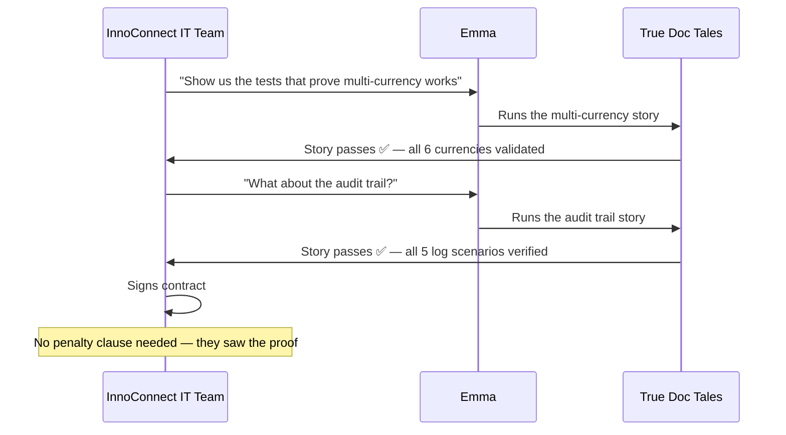

# The Day Documentation Became Evidence

Six months ago, Thomas was on a call with InnoConnect's legal team, authorising a €50,000 penalty transfer.

Today, he is on a call with InnoConnect's CEO. They are discussing expanding the contract.

The difference between those two calls is a single decision the team made five months ago: **every story we write will be a test we can run**.

> Prequels
> - [The Team](../00_prequels/03_create-business-heroes.md)
> - [The Villains](../00_prequels/04_create-business-villains.md)

## Scene: The turning point — a retrospective nobody wanted to have

The meeting after the InnoConnect penalty was the worst in FinTrack history.

Thomas had the post-mortem reports printed out. Three incidents. Three different root causes — but one pattern.

*Every failure happened in the gap between what was written and what was verified.*

Emma wrote stories that described features not yet built. Alex marked tickets done before all criteria were implemented. The payment approval story had no concrete example — so it was implemented literally instead of correctly.

Stefan proposed True Doc Tales. His argument was simple: *"If the story runs as a test, we cannot lie to ourselves about whether it is true."*

> **Quest** Create quest
>
> | id | name                       | description                                                          | status      |
> |----|----------------------------|----------------------------------------------------------------------|-------------|
> | 20 | Adopt True Doc Tales       | Integrate executable documentation into the delivery workflow        | IN_PROGRESS |

> **Quest** Assign to hero
>
> | hero   | quest                |
> |--------|----------------------|
> | Stefan | Adopt True Doc Tales |

The team agreed. Not enthusiastically — change rarely is. But they agreed.

## Scene: Emma learns to write stories that can be proven

The first thing that changed was Emma's writing process.

Before, she wrote stories to communicate intent. Now, she writes stories that can be executed. Every acceptance criterion must have a concrete example. Every claim in the product catalogue must have a passing test behind it.

Her first True Doc Tales story is the multi-currency feature — the one that had been in the documentation for two years and never built.

> **Hero** Grant skill
>
> | heroName | skill                        |
> |----------|------------------------------|
> | Emma     | Executable Specifications    |
> | Emma     | Living Documentation         |

> **Hero** Has skill
>
> | heroName | skill                     |
> |----------|---------------------------|
> | Emma     | Executable Specifications |

> **Monster** Monster is dead
>
> | name                  |
> |-----------------------|
> | Unimplemented Feature |

She removes every feature from the catalogue that cannot be backed by a running test. The catalogue shrinks from 1001 entries to 312. It is a painful afternoon. It is also the first afternoon in four years where the catalogue tells the truth.

*312 features. All of them proven. All of them documented. All of them real.*

> **Achievement** Unlocked
>
> | hero  | achievement                     |
> |-------|---------------------------------|
> | Emma  | Curator of Proven Documentation |

## Scene: Alex discovers what done actually means

The second thing that changed was what it meant to close a ticket.

A story in True Doc Tales is not done when the developer says so. It is done when all the acceptance criteria are green. The test runs on every commit. If criterion 3 is missing, the test fails at criterion 3. Alex cannot move the ticket to done while any criterion is red.

> **Hero** Grant skill
>
> | heroName | skill                           |
> |----------|---------------------------------|
> | Alex     | Complete Specification Coverage |

> **Hero** Has skill
>
> | heroName | skill                           |
> |----------|---------------------------------|
> | Alex     | Complete Specification Coverage |

The first time Alex tries to close a ticket with criteria 2 through 5 unimplemented, the story fails at criterion 2. He sees the failure message. He knows exactly what is missing. He implements it. The test passes. He moves on.

On Wednesday of that sprint, he has fewer green tickets than before. Every ticket that is green is fully green.

> **Monster** Monster is dead
>
> | name                    |
> |-------------------------|
> | Partial Implementation  |
> | Missing Acceptance Test |

> **Achievement** Unlocked
>
> | hero | achievement             |
> |------|-------------------------|
> | Alex | Complete Implementation |

## Scene: Maria verifies the story — not the code

The third thing that changed was Maria's role.

Before, Maria was the last line of defence — the person who found problems after they had already been built and deployed. She was always under pressure, always working with a deadline behind her.

With True Doc Tales, the story is already the verification. When Maria opens a ticket, she does not start from scratch. She reads the story, sees which criteria ran, sees which passed, sees the evidence. She focuses on the edge cases and the business scenarios that the story does not yet cover.

She is no longer cleaning up after the sprint. She is strengthening it.

> **Hero** Grant skill
>
> | heroName | skill                   |
> |----------|-------------------------|
> | Maria    | Automated Verification  |

> **Hero** Has skill
>
> | heroName | skill                   |
> |----------|-------------------------|
> | Maria    | Automated Verification  |

> **Monster** Monster is dead
>
> | name                    |
> |-------------------------|
> | Documentation Drift     |
> | Blame Culture           |

> **Achievement** Unlocked
>
> | hero  | achievement                    |
> |-------|--------------------------------|
> | Maria | Guardian of Living Proof       |

## Scene: Thomas reads a story — not a slide deck

Thomas used to review sprint results through velocity charts, delivery reports, and executive summaries. He had learned that these numbers meant different things to different people.

Now he reads the stories directly.

A story about the expense approval workflow tells him, in plain language, what the system does — and the test result tells him it is true. He does not have to trust the developer's word or the product owner's summary. He reads the story, sees the green tests, and knows.

> **Hero** Grant skill
>
> | heroName | skill                   |
> |----------|-------------------------|
> | Thomas   | Verified Documentation  |

> **Hero** Has skill
>
> | heroName | skill                   |
> |----------|-------------------------|
> | Thomas   | Verified Documentation  |

> **Achievement** Unlocked
>
> | hero   | achievement                         |
> |--------|-------------------------------------|
> | Thomas | Stakeholder Who Trusts the Evidence |

The team has adopted True Doc Tales. The transformation is complete.

> **Quest** Complete quest
>
> | hero   | quest                |
> |--------|----------------------|
> | Stefan | Adopt True Doc Tales |

> **Quest** Status is
>
> | quest                | expectedStatus |
> |----------------------|----------------|
> | Adopt True Doc Tales | COMPLETED      |

## Scene: InnoConnect's second chance — and the stories that prove it

Three months after adopting True Doc Tales, InnoConnect returns.

They want a new module: multi-currency expense tracking — the exact feature that had been in Emma's documentation for two years without ever being built. This time, they ask for something different before signing.

*"Can you show us the tests that prove the feature works?"*

Emma opens the True Doc Tales story for multi-currency support.

> **Quest** Create quest
>
> | id | name                              | description                                                           | status      |
> |----|-----------------------------------|-----------------------------------------------------------------------|-------------|
> | 21 | InnoConnect Multi-Currency Module | Deliver verified multi-currency expense tracking for InnoConnect      | IN_PROGRESS |

> **Quest** Assign to hero
>
> | hero   | quest                             |
> |--------|-----------------------------------|
> | Stefan | InnoConnect Multi-Currency Module |

> **Hero** Grant skill
>
> | heroName | skill                          |
> |----------|--------------------------------|
> | Stefan   | Executable Specifications      |

The stories run. Every scenario passes. InnoConnect's IT team watches the test execution live on screen.

They do not ask for the product catalogue. They do not ask for written guarantees. They run the stories themselves and see that everything claimed is proven.

> **Quest** Complete quest
>
> | hero   | quest                             |
> |--------|-----------------------------------|
> | Stefan | InnoConnect Multi-Currency Module |

> **Quest** Status is
>
> | quest                             | expectedStatus |
> |-----------------------------------|----------------|
> | InnoConnect Multi-Currency Module | COMPLETED      |

> **Monster** Monster is dead
>
> | name          |
> |---------------|
> | Audit Failure |

> **Achievement** Unlocked
>
> | hero   | achievement              |
> |--------|--------------------------|
> | Emma   | Trust Rebuilt            |
> | Alex   | Sprint Integrity Restored |
> | Maria  | Quality at Every Commit  |
> | Thomas | Evidence-Based Decisions |
> | Stefan | Architecture of Truth    |

## The Outcome

The InnoConnect contract is signed. No penalty clause. No remediation plan. No ambiguity about what is included.

FinTrack's product catalogue now has 312 entries. Every one of them is backed by a running story. When Emma adds a new feature to the catalogue, she writes the story first — and the story must pass before the feature is published.

When Alex marks a ticket done, all criteria are green. When Lucas picks up a ticket, he cannot skip to criterion 5 before criteria 1 through 4 are verified.

When Thomas asks *"can the system do this?"*, the answer is not a product manager's assessment or a developer's estimate. The answer is a test result.

| Before | After |
|--------|-------|
| 1001 documented features | 312 verified features |
| "Yes, it's in the documentation" | "Yes, the story passes" |
| Gaps discovered at customer onboarding | Gaps discovered at commit |
| Penalty clauses invoked | Contracts fulfilled |
| Blame in retrospectives | Evidence in reviews |

## Moral of the Story

**Trust is not built by writing more documentation. It is built by proving what the documentation claims.**

The FinTrack team did not change their process dramatically. They did not hire more people. They did not buy a new tool for the sake of it. They changed one rule:

*A story is not true until it has been executed and it has passed.*

That single rule changed what it meant to say "done". It changed what it meant to say "this feature exists". It changed what Thomas could confidently tell InnoConnect, what Emma could confidently publish, and what Alex could confidently close.

The documentation stopped being a mirror that showed everyone what they wanted to see.

It became evidence.

> **Hero** Trophy earned
>
> | hero   | trophy                           |
> |--------|----------------------------------|
> | Emma   | Product Catalogue of Truth       |
> | Alex   | Sprint with Zero False Positives |
> | Maria  | First-Time Quality Champion      |
> | Thomas | Evidence-Based Stakeholder       |
> | Stefan | Architect of Trusted Delivery    |

*The team opens the next sprint planning.*
*Emma starts writing a story.*
*She writes the example table first.*
