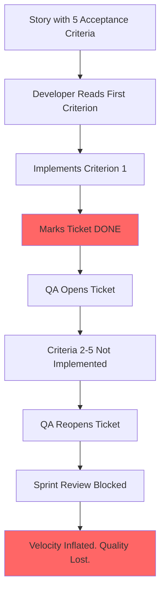

# The Squirrel Dev

## Overview

This chapter tells the story of a **Developer** with the attention span of a squirrel — fast, eager, and convinced that every task is finished after the first sentence.

The story shows what happens when a developer reads only the first acceptance criterion, implements it, marks the ticket as done, and rushes to the next one. The rest of the requirements are left behind, like forgotten nuts buried under snow.

## The Problem

A story has five acceptance criteria. The developer reads the first one. It sounds clear. They implement it. They mark the ticket as done and move on.

The QA Engineer opens the ticket. She reads all five criteria. Four of them are untouched.

## What Goes Wrong

- ✗ Acceptance criteria are read selectively — only the first item is implemented
- ✗ The story is marked as done before verification
- ✗ Other team members discover the gap only during testing or in production
- ✗ Partially built features reach the sprint review
- ✗ The team loses trust in the definition of "done"

## Story Structure

*"Done!" said the squirrel, and leaped to the next tree.*
*Behind it: four acorns, still buried.*
