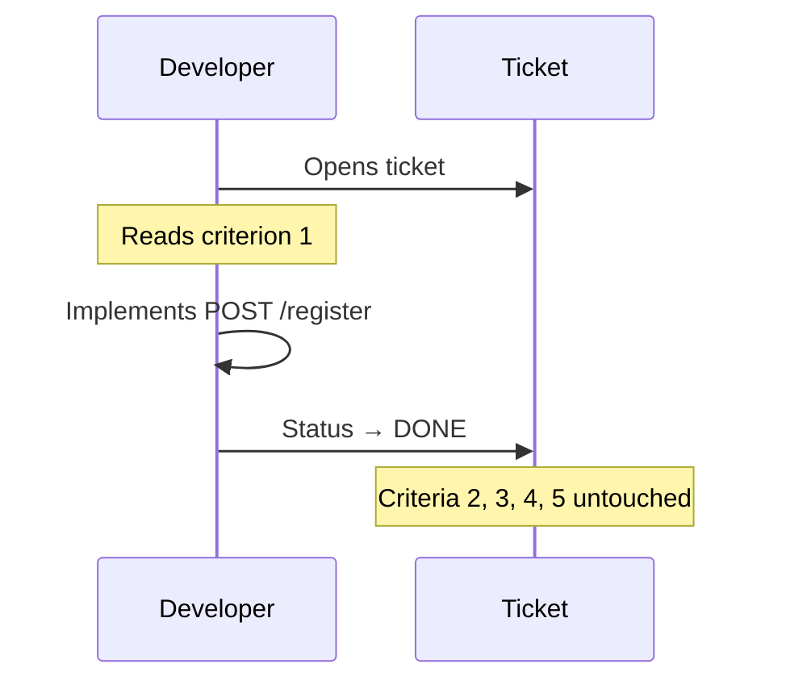

# The Squirrel Dev — Done After the First Line

There was once a Developer who moved very fast. He was proud of it. He would pick up a ticket in the morning, write some code by noon, and declare it done before lunch. By the end of the sprint, his board was full of green checkmarks.

Nobody looked closely at the checkmarks.

> Prequels
> - [Create Business Heroes](../00_prequels/03_create-business-heroes.md)
> - [Create Business Villains](../00_prequels/04_create-business-villains.md)

## Scene: The user registration story

The Product Owner creates a user story for the new customer registration feature. It has five acceptance criteria — all clearly written, all important.

> **Quest** Create quest
>
> | id | name                       | description                                                                | status      |
> |----|----------------------------|----------------------------------------------------------------------------|-------------|
> | 11 | Implement User Registration | Register new users with validation, confirmation email, and audit logging  | IN_PROGRESS |

> **Quest** Assign to hero
>
> | hero      | quest                       |
> |-----------|-----------------------------|
> | Developer | Implement User Registration |

> **Quest** Status is
>
> | quest                       | expectedStatus |
> |-----------------------------|----------------|
> | Implement User Registration | IN_PROGRESS    |

The story reads:

```
Acceptance Criteria:
1. A user can register with an email address and password
2. The email address must be validated for correct format
3. A confirmation email is sent after successful registration
4. Duplicate registrations with the same email are rejected
5. All registration attempts are written to the audit log
```

## Scene: The squirrel reads the first line

The Developer opens the ticket. He reads: *"A user can register with an email address and password."*

He nods. He writes the endpoint. He creates the user in the database. He marks the ticket as done.



> **Quest** Complete quest
>
> | hero      | quest                       |
> |-----------|-----------------------------|
> | Developer | Implement User Registration |

> **Quest** Status is
>
> | quest                       | expectedStatus |
> |-----------------------------|----------------|
> | Implement User Registration | COMPLETED      |

But it was not complete. Only one fifth of it was complete. The rest of the criteria were still buried underground, like acorns the squirrel had forgotten.

## Scene: The QA Engineer opens the ticket

The QA Engineer picks up the story to verify. She reads all five criteria. She opens her test suite. She starts checking.

> **Monster** Monster is alive
>
> | name                    |
> |-------------------------|
> | Partial Implementation  |
> | Missing Acceptance Test |

She discovers:
- Email format validation: not implemented — any string is accepted
- Confirmation email: not sent
- Duplicate rejection: not implemented — the same email can register ten times
- Audit log: not written

> **Fight** Attack fails
>
> | attacker     | defender               | weapon        | result |
> |--------------|------------------------|---------------|--------|
> | QA Engineer  | Partial Implementation | Test Report   | FAILED |

The QA Engineer reopens the ticket. She adds comments. She describes each missing criterion with a test case.

The sprint review is approaching. The ticket is back in progress.

## Scene: The sprint review — velocity without quality

At the sprint review, the team presents their completed stories. The Stakeholder asks about user registration. The Developer says it is done.

The QA Engineer says: four out of five criteria are not implemented.

> **Monster** Monster is alive
>
> | name                    |
> |-------------------------|
> | Blame Culture           |

The Stakeholder looks at the velocity chart. It shows a productive sprint. But the feature cannot be released. The audit log is missing. This is a compliance requirement. The confirmation email is missing. Users who register never receive it.

> **Fight** Attack fails
>
> | attacker    | defender               | weapon           | result |
> |-------------|------------------------|------------------|--------|
> | Tech Lead   | Partial Implementation | Code Review      | FAILED |
> | Stakeholder | Partial Implementation | Sprint Feedback  | FAILED |

The Developer says: *"I built what was most important first. I was planning to do the rest in the next sprint."*

Nobody had agreed to that plan.

## Moral of the Story

**A story is not done when one criterion is green. It is done when all criteria are verified.**

When "done" means "I started it", the whole team loses trust in progress. Velocity becomes a number that represents ambition, not reality.

- ✗ Partial implementation creates invisible technical debt
- ✗ A done ticket that is not done misleads the entire team
- ✗ Compliance gaps discovered late are expensive and dangerous
- ✗ Speed without completeness is not velocity — it is noise

*The squirrel leaps from tree to tree. The buried acorns stay buried.*
*And when winter comes, nobody can find them.*
