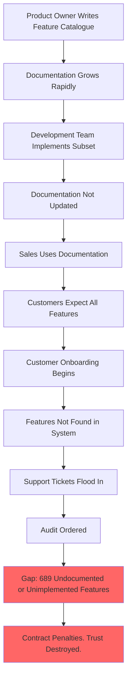

# The Product Queen and Her 1001 Features

## Overview

This chapter tells the story of a **Product Owner** who believes she rules a kingdom of infinite capability. She writes documentation like a queen issuing royal decrees — confidently, prolifically, and without checking whether the kingdom can actually fulfil her commands.

The story shows what happens when documentation grows faster than implementation, when features are described but never built, and when the gap between the product catalogue and the real system becomes impossible to hide.

## The Problem

The product documentation lists 1001 features. The system implements 312 of them. Nobody noticed — until the audit.

## What Goes Wrong

- ✗ Features are documented as existing before they are built
- ✗ Product catalogues drift away from the actual system
- ✗ Customers are promised features that do not exist
- ✗ Internal teams rely on documentation that describes a fantasy
- ✗ The audit reveals the gap — with serious consequences

## Story Structure

*"The catalogue says we have it," said the queen.*
*"The system says we do not," said the auditor.*
