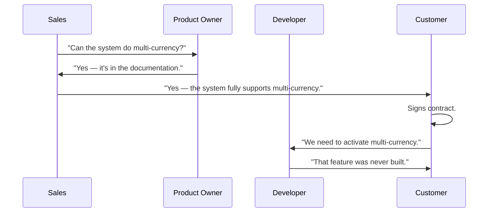
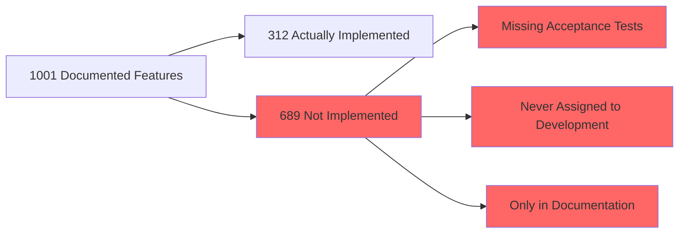

# The Product Queen and Her 1001 Features

Once upon a product, there was a Product Owner who believed that writing about a feature was the same as delivering it.

She was talented. She was fast. She could describe a feature in ten minutes, complete with wireframes, business rules, and edge cases. Her documentation was beautiful. Her product catalogue was legendary.

It listed 1001 features.

The system had 312 of them.

> Prequels
> - [Create Business Heroes](../00_prequels/03_create-business-heroes.md)
> - [Create Business Villains](../00_prequels/04_create-business-villains.md)

## Scene: The catalogue grows

The Product Owner opens her documentation tool. She has ideas. She has visions. She writes them down — in full detail, as if they were already built.

> **Quest** Create quest
>
> | id | name                         | description                                                      | status      |
> |----|------------------------------|------------------------------------------------------------------|-------------|
> | 12 | Publish Product Feature Docs | Document all planned and existing product capabilities           | IN_PROGRESS |

> **Quest** Assign to hero
>
> | hero          | quest                        |
> |---------------|------------------------------|
> | Product Owner | Publish Product Feature Docs |

She documents:
- The payment module (built — and working)
- The reporting dashboard (built — partially working)
- The multi-currency support (planned — never started)
- The advanced user permissions system (planned — design document exists)
- The audit trail export (planned — ticket created, never pulled)
- The partner integration API (discussed — no ticket exists)

The documentation does not say "planned". It says "the system supports".

> **Quest** Complete quest
>
> | hero          | quest                        |
> |---------------|------------------------------|
> | Product Owner | Publish Product Feature Docs |

> **Quest** Status is
>
> | quest                        | expectedStatus |
> |------------------------------|----------------|
> | Publish Product Feature Docs | COMPLETED      |

## Scene: The sales team finds the catalogue

Sales opens the product documentation. It is impressive. It is thorough. It describes a world-class system with enterprise features, compliance support, and powerful integrations.

They use it in every customer meeting.

> **Monster** Monster is alive
>
> | name                    |
> |-------------------------|
> | Unimplemented Feature   |
> | Documentation Drift     |

## Scene: The customer arrives

The first enterprise customer signs the contract. They paid for the full feature set. They begin onboarding.

> **Quest** Create quest
>
> | id | name                        | description                                              | status      |
> |----|-----------------------------|----------------------------------------------------------|-------------|
> | 13 | Enterprise Customer Onboard | Activate all contracted features for the new enterprise  | IN_PROGRESS |

> **Quest** Assign to hero
>
> | hero      | quest                       |
> |-----------|-----------------------------|
> | Developer | Enterprise Customer Onboard |

The Developer opens the documentation. He opens the codebase. He starts comparing.

Feature by feature, he discovers the gap.

> **Fight** Attack fails
>
> | attacker  | defender              | weapon       | result |
> |-----------|-----------------------|--------------|--------|
> | Developer | Unimplemented Feature | Code         | FAILED |
> | Developer | Documentation Drift   | Code Review  | FAILED |

The multi-currency module does not exist. The partner API does not exist. The audit trail export does not exist. The advanced permissions system is a design document from eighteen months ago.

> **Quest** Status is
>
> | quest                       | expectedStatus |
> |-----------------------------|----------------|
> | Enterprise Customer Onboard | IN_PROGRESS    |

The quest cannot be completed. The features are not there.

## Scene: The audit — the queen's kingdom revealed

The customer escalates. An external auditor is called. They are given the product documentation and access to the system.

> **Quest** Create quest
>
> | id | name                      | description                                        | status      |
> |----|---------------------------|----------------------------------------------------|-------------|
> | 14 | External Product Audit    | Verify that the documented features exist in the system | IN_PROGRESS |

The auditor checks feature by feature. They document every discrepancy.

> **Monster** Monster is alive
>
> | name          |
> |---------------|
> | Audit Failure |

> **Fight** Attack fails
>
> | attacker      | defender      | weapon               | result |
> |---------------|---------------|----------------------|--------|
> | Product Owner | Audit Failure | Feature Explanations | FAILED |
> | Tech Lead     | Audit Failure | Architecture Review  | FAILED |

The audit report is published. 689 features listed in the product catalogue have no corresponding implementation, no test coverage, and no delivery plan.

Contract penalties follow. The enterprise customer suspends the engagement. The sales team stops using the documentation.

> **Monster** Monster is alive
>
> | name                    |
> |-------------------------|
> | Blame Culture           |
> | Unimplemented Feature   |
> | Audit Failure           |

## Moral of the Story

**Documentation that describes a future that was never built is not documentation. It is a promise that was never kept.**

The Product Owner did not intend to mislead anyone. She was planning ahead. She was being thorough. But without a connection between the written story and verified delivery, the documentation became a liability.

- ✗ Features documented as available before they are built erode trust
- ✗ Sales and customers rely on documentation as truth — they have no other source
- ✗ Without verification, the gap between the catalogue and reality grows silently
- ✗ Audit failures and contract penalties are the late and expensive discovery of that gap

*The queen has 1001 features in her catalogue.*
*And 689 of them exist only in her kingdom of documentation.*
*The customers live in a different kingdom — the one that was actually built.*
